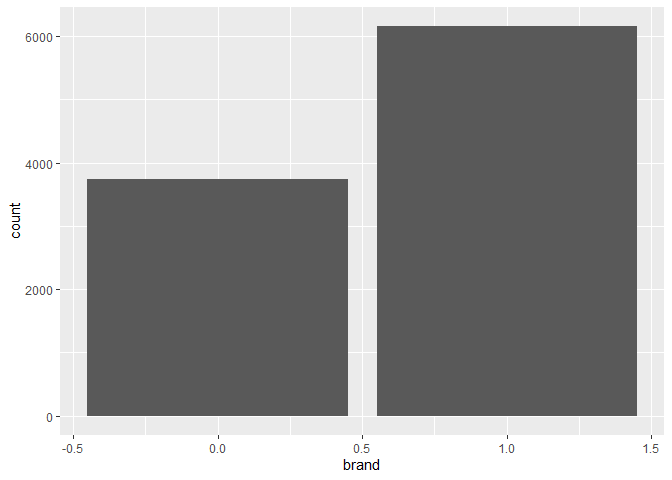
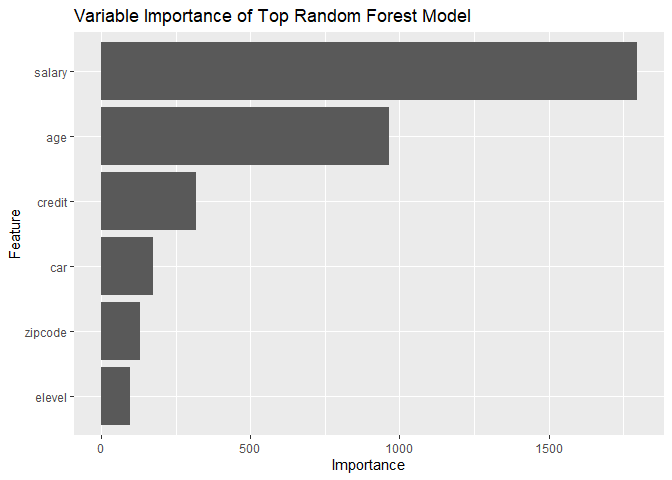
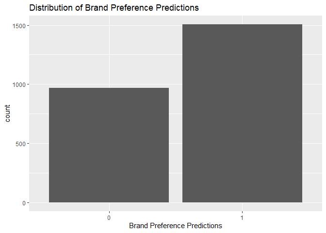
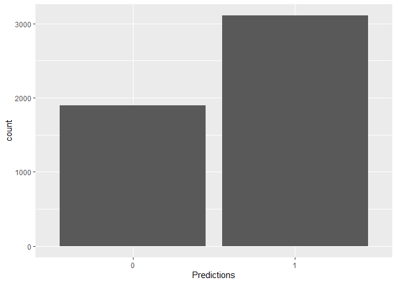

## Background
#### An Electronics Company would like for us to predict which computer brand customers from a new region will prefer, Acer or Sony. Doing so will help to determine inventory needs for new clientele and individual customer brand preferences for robust in-store and online marketing efforts. 

## Objective
#### The objective is to build predictive models and choose a model that can predict consumer computer brand preferene with at least 80% accuracy on test data. Ideal goal is a model that can predict brand preference with at least 90% level of certainty.


## Load libraries

```r
# Loading packages
library(tidyverse)
library(caret)
library(ggplot2)
library(corrplot)
library(openxlsx)
library(h2o)
library(knitr)
library(kableExtra)
```

## Import data

```r
# training data
complete <- read.csv(file.path('C:/Users/jlbro/OneDrive/C3T2/C3T2', 'complete.csv'), stringsAsFactors = TRUE)

# testing data
incomplete <- read.csv(file.path('C:/Users/jlbro/OneDrive/C3T2/C3T2', 'incomplete.csv'), stringsAsFactors = TRUE)
```

## Understand data

```r
# check structure of training data
str(complete)
```

```
## 'data.frame':	9898 obs. of  7 variables:
##  $ salary : num  119807 106880 78021 63690 50874 ...
##  $ age    : int  45 63 23 51 20 56 24 62 29 41 ...
##  $ elevel : int  0 1 0 3 3 3 4 3 4 1 ...
##  $ car    : int  14 11 15 6 14 14 8 3 17 5 ...
##  $ zipcode: int  4 6 2 5 4 3 5 0 0 4 ...
##  $ credit : num  442038 45007 48795 40889 352951 ...
##  $ brand  : int  0 1 0 1 0 1 1 1 0 1 ...
```

#### Observations
* 9898 total observations with 7 total features
* Six features are customer description variables, one feature is consumer brand preference, 'brand'
* The data description tells us the codes for brand: Acer=0 and Sony=1


```r
# check descriptive stats
summary(complete)
```

```
##      salary            age            elevel           car       
##  Min.   : 20000   Min.   :20.00   Min.   :0.000   Min.   : 1.00  
##  1st Qu.: 52082   1st Qu.:35.00   1st Qu.:1.000   1st Qu.: 6.00  
##  Median : 84950   Median :50.00   Median :2.000   Median :11.00  
##  Mean   : 84871   Mean   :49.78   Mean   :1.983   Mean   :10.52  
##  3rd Qu.:117162   3rd Qu.:65.00   3rd Qu.:3.000   3rd Qu.:15.75  
##  Max.   :150000   Max.   :80.00   Max.   :4.000   Max.   :20.00  
##     zipcode          credit           brand       
##  Min.   :0.000   Min.   :     0   Min.   :0.0000  
##  1st Qu.:2.000   1st Qu.:120807   1st Qu.:0.0000  
##  Median :4.000   Median :250607   Median :1.0000  
##  Mean   :4.041   Mean   :249176   Mean   :0.6217  
##  3rd Qu.:6.000   3rd Qu.:374640   3rd Qu.:1.0000  
##  Max.   :8.000   Max.   :500000   Max.   :1.0000
```

```r
summary(complete$brand)
```

```
##    Min. 1st Qu.  Median    Mean 3rd Qu.    Max. 
##  0.0000  0.0000  1.0000  0.6217  1.0000  1.0000
```


```r
# histogram of 'brand'
ggplot(complete) +
  geom_histogram(aes(brand), stat = 'count', bins = 2)
```

<!-- -->

#### Binary classification is slightly imbalanced, 62/38

## Preprocessing

```r
# check for NAs
sum(is.na(complete))
```

```
## [1] 0
```

```r
# change data type and values
complete$brand <- as.factor(complete$brand)

str(complete)
```

```
## 'data.frame':	9898 obs. of  7 variables:
##  $ salary : num  119807 106880 78021 63690 50874 ...
##  $ age    : int  45 63 23 51 20 56 24 62 29 41 ...
##  $ elevel : int  0 1 0 3 3 3 4 3 4 1 ...
##  $ car    : int  14 11 15 6 14 14 8 3 17 5 ...
##  $ zipcode: int  4 6 2 5 4 3 5 0 0 4 ...
##  $ credit : num  442038 45007 48795 40889 352951 ...
##  $ brand  : Factor w/ 2 levels "0","1": 1 2 1 2 1 2 2 2 1 2 ...
```

## Modeling

```r
set.seed(123)
# createDataPartition() 75% and 25%
index1 <- createDataPartition(complete$brand, p=0.75, list = FALSE)
train1 <- complete[ index1,]
test1 <- complete[-index1,]

# Check structure of trainSet
str(train1)
```

```
## 'data.frame':	7424 obs. of  7 variables:
##  $ salary : num  119807 106880 78021 63690 130813 ...
##  $ age    : int  45 63 23 51 56 24 62 29 48 52 ...
##  $ elevel : int  0 1 0 3 3 4 3 4 4 1 ...
##  $ car    : int  14 11 15 6 14 8 3 17 16 6 ...
##  $ zipcode: int  4 6 2 5 3 5 0 0 5 0 ...
##  $ credit : num  442038 45007 48795 40889 135943 ...
##  $ brand  : Factor w/ 2 levels "0","1": 1 2 1 2 2 2 2 1 2 1 ...
```

```r
# set cross validation
control <- trainControl(method = 'repeatedcv', 
                        number=10, 
                        repeats = 1)
```

## Random Forest using automatic tuning

```r
set.seed(123)

# train algorithm
rf1 <- train(brand~.,
             data = train1,
             method = 'rf',
             trControl = control,
             tuneLength = 1) 

rf1
```

```
## Random Forest 
## 
## 7424 samples
##    6 predictor
##    2 classes: '0', '1' 
## 
## No pre-processing
## Resampling: Cross-Validated (10 fold, repeated 1 times) 
## Summary of sample sizes: 6681, 6681, 6681, 6682, 6681, 6683, ... 
## Resampling results:
## 
##   Accuracy   Kappa    
##   0.9172925  0.8246223
## 
## Tuning parameter 'mtry' was held constant at a value of 2
```

## Random forest using manual tuning

```r
set.seed(123)
# train 
rf2 <- train(brand~.,
             data = train1,
             method = 'rf',
             trControl=control,
             tuneLength = 5) 

rf2
```

```
## Random Forest 
## 
## 7424 samples
##    6 predictor
##    2 classes: '0', '1' 
## 
## No pre-processing
## Resampling: Cross-Validated (10 fold, repeated 1 times) 
## Summary of sample sizes: 6681, 6681, 6681, 6682, 6681, 6683, ... 
## Resampling results across tuning parameters:
## 
##   mtry  Accuracy   Kappa    
##   2     0.9176981  0.8252764
##   3     0.9176985  0.8252930
##   4     0.9171598  0.8240410
##   5     0.9155429  0.8203682
##   6     0.9132536  0.8155551
## 
## Accuracy was used to select the optimal model using the largest value.
## The final value used for the model was mtry = 3.
```

#### Observations
* Both Random forest models are about the same. We will use Random Forest 1 with an mtry of 2 and 91.8% accuracy, as it is simpler and faster model and meets client goal of at least 80% accuracy.
* Kappa is 82.5%, which is a more useful determination of accuracy if predicted class is imbalanced, as it helps normalize an imbalance in the classes.


```r
# variable importance using ggplot
ggplot(varImp(rf1, scale=FALSE)) +
  geom_bar(stat = 'identity') +
  ggtitle('Variable Importance of Top Random Forest Model')
```

<!-- -->

## Predict on test dataset using optimal model

```r
rfPreds <- predict(rf1, newdata = test1)
```


```r
# predict using type = 'prob' helps see prediction for each observation
rfProbs <- predict(rf1, newdata = test1, type = 'prob')
head(rfProbs, 10)
```

```
##        0     1
## 5  0.600 0.400
## 10 0.092 0.908
## 14 0.918 0.082
## 30 0.040 0.960
## 31 0.004 0.996
## 38 0.172 0.828
## 39 0.496 0.504
## 45 0.646 0.354
## 55 0.194 0.806
## 56 0.926 0.074
```

## Confusion matrix of top model

```r
confusionMatrix(data = rfPreds, test1$brand)
```

```
## Confusion Matrix and Statistics
## 
##           Reference
## Prediction    0    1
##          0  861  108
##          1   75 1430
##                                         
##                Accuracy : 0.926         
##                  95% CI : (0.915, 0.936)
##     No Information Rate : 0.6217        
##     P-Value [Acc > NIR] : < 2e-16       
##                                         
##                   Kappa : 0.8438        
##                                         
##  Mcnemar's Test P-Value : 0.01801       
##                                         
##             Sensitivity : 0.9199        
##             Specificity : 0.9298        
##          Pos Pred Value : 0.8885        
##          Neg Pred Value : 0.9502        
##              Prevalence : 0.3783        
##          Detection Rate : 0.3480        
##    Detection Prevalence : 0.3917        
##       Balanced Accuracy : 0.9248        
##                                         
##        'Positive' Class : 0             
## 
```

#### Observation
* Confusion matrix shows 92.6% accuracy, 92% sensitivity (% of positives we are catching), and 93% specificity (% of negatives we are catching). This is a good model.


```r
# postResample reveals if it will do well in real world or if it is overfitting
postResample(rfPreds, test1$brand)
```

```
##  Accuracy     Kappa 
## 0.9260307 0.8438283
```

#### rf1 is not overfitting, accuracy and kappas are both comparable and high


```r
# compare predictions to actual within same data frame
compare_rf <- data.frame(test1,rfPreds) 
head(compare_rf, 100)
```

```
##        salary age elevel car zipcode     credit brand rfPreds
## 5    50873.62  20      3  14       4 352951.498     0       0
## 10   37803.33  41      1   5       4 493219.269     1       1
## 14   82474.58  33      4  13       3 424657.497     0       0
## 30  107710.32  75      0  16       2 209002.407     1       1
## 31  148495.44  62      2   9       1 377495.295     1       1
## 38   49692.10  42      4   8       2 462826.149     1       1
## 39  101454.63  26      0  18       2  22960.800     0       1
## 45   87634.05  59      2   5       6 206711.940     1       0
## 55   81015.26  63      0   7       7 250036.000     1       1
## 56   88405.44  36      4   8       7 195042.678     0       0
## 63   83185.07  62      4   2       8 163108.438     1       0
## 64   31430.24  47      4  10       2 177297.720     1       1
## 70  131957.81  65      4  11       1 238253.007     1       1
## 74  131927.71  63      1   8       1 424565.963     1       1
## 75  110539.06  64      4  11       6 257476.590     1       1
## 76  133162.37  69      0   7       8 413996.477     1       1
## 81  137368.94  57      4  12       8 415156.282     1       1
## 82   43377.96  30      0   6       2 190336.160     1       1
## 83   85919.99  75      3   7       1  43412.866     1       1
## 89   47399.24  21      4   2       3 362188.027     1       1
## 97   34759.48  58      4  16       1 396818.591     1       1
## 98  141628.04  75      2  18       3 326686.025     1       1
## 109  27102.74  46      0  16       2 293842.154     1       1
## 116  96839.45  53      1  18       4 393853.363     0       0
## 118 100820.01  70      4   4       6 463076.230     1       1
## 119 129274.99  29      2  12       0  98820.083     1       1
## 124  43727.81  43      3  19       1 199837.255     1       1
## 130  23964.83  57      1  17       4 165441.501     1       1
## 132 134663.82  51      1   2       1 476990.362     1       1
## 133  27705.56  41      4  16       5 213908.798     1       1
## 134  68420.38  26      4  14       2 485034.815     0       0
## 136  45257.89  40      2  11       4 374850.874     1       1
## 140 109830.17  24      1   9       8 144156.978     1       1
## 143  58089.91  45      2   9       5 460439.314     1       1
## 144 138483.51  34      4  17       7 158932.977     1       1
## 147 137794.61  24      0  13       2 216481.904     1       1
## 151 111872.72  41      0   8       1  13674.562     0       0
## 153 133279.78  41      2  15       6 260987.137     1       1
## 158 106841.00  78      3   2       5 386222.361     1       1
## 161  92422.59  52      2   8       2 308886.506     0       0
## 163  66938.52  47      1  11       8  15198.151     1       1
## 169 119888.63  41      0   3       6 328779.040     0       0
## 170 128751.15  66      0   2       0 394010.991     1       1
## 175 132530.65  25      1   5       4 145812.348     1       1
## 176  23520.41  72      2   8       7 313318.661     0       1
## 177  29819.80  57      4   4       4 186745.141     1       1
## 179  68054.64  61      1  20       3 277300.510     0       0
## 182 130455.16  56      4  20       1  92299.373     1       1
## 190 101445.01  23      2  15       2 243688.702     1       1
## 192  54661.20  32      0  18       7 168218.382     0       0
## 196 103158.63  44      1   5       0 244790.504     0       0
## 197  58555.51  62      2  19       3 389687.140     0       0
## 204  48777.81  28      0  15       7 500000.000     0       1
## 206 127367.22  78      0  11       2 252011.588     1       1
## 207 121775.83  30      1  11       8      0.000     1       1
## 208 138178.88  53      4  20       3 102848.193     1       1
## 216  68366.52  43      4  14       2 355413.199     1       1
## 219 130119.76  46      0   1       1 277130.032     1       1
## 229  96160.32  61      2   6       3 328170.531     1       0
## 230  61926.03  62      2   2       2 353903.981     0       0
## 231  89248.67  42      4  15       0 453443.387     0       0
## 233  73906.88  32      4  17       8 499164.343     0       0
## 234  30284.09  22      4  13       7 280717.295     1       1
## 238  75378.27  49      0  19       6  92529.983     1       0
## 244  51667.39  70      2   1       8 347967.023     0       0
## 245 127191.59  39      0  18       1 166839.029     1       1
## 250  31327.02  37      3  14       5 244495.552     1       1
## 253  59217.18  58      0  10       2 173339.583     0       1
## 259 104663.80  77      1  19       2 309124.886     1       1
## 261 140924.81  80      2   3       0 299265.761     1       1
## 264 106795.67  58      2   4       8 137897.615     1       0
## 270 115429.48  57      0   1       4 145421.506     0       0
## 274  52866.81  73      1   6       5  61389.592     0       0
## 276  45116.39  28      4  16       6 281700.230     1       1
## 278 127504.25  47      4   6       5 422383.878     1       1
## 279  35821.32  58      2  11       3 327520.885     1       1
## 281 150000.00  80      1  19       3 249547.659     1       1
## 287  65666.11  77      0   8       4  11105.343     0       0
## 292  86242.63  22      4  10       4 206786.427     0       0
## 296 100577.60  35      2   8       7 288933.139     1       1
## 305  79986.35  49      3   2       6 500000.000     0       0
## 306  44697.96  70      3   3       2 195563.429     0       0
## 307  32394.89  77      4   7       5 383085.772     0       0
## 308 143742.35  80      4  11       8 129507.011     1       1
## 310 138335.93  50      1   6       6      0.000     1       1
## 313 111228.29  75      2   9       7 390871.986     1       1
## 315  43943.42  78      3  10       2 140100.814     0       0
## 316 103863.52  44      4  17       5 120606.688     0       0
## 320  35888.78  59      2  14       0  16701.637     0       0
## 327  43465.95  79      3  11       4 305635.722     0       0
## 334 126044.39  26      2   2       1 113170.066     1       1
## 336 116184.32  57      4  20       5 472757.667     0       0
## 339 142443.02  80      3  14       2 217056.567     1       1
## 342 141371.40  57      2  20       3   6758.351     1       1
## 345  41864.34  60      3  15       5  58115.384     1       0
## 353 135945.74  50      3  13       1 238705.912     1       1
## 354  96689.22  54      2  10       3 487481.529     0       0
## 355  68762.77  23      3   5       2 114843.394     0       0
## 356 122551.72  49      4   6       7 302519.882     0       0
## 357  75542.85  43      2  20       4 282457.597     0       0
```


```r
# summarize and plot
summary(rfPreds)
```

```
##    0    1 
##  969 1505
```

```r
ggplot(compare_rf) +
  geom_histogram(aes(rfPreds), stat = 'count', bins = 2) +
  xlab('Brand Preference Predictions') +
  ggtitle('Distribution of Brand Preference Predictions')
```

<!-- -->
#### Model predicted on test data similar ratio of actual brand preference (38% Acer to 62% Sony)

## Predict brand preference on new customer dataset: 'incomplete'

```r
# check structure of new dataset
str(incomplete)
```

```
## 'data.frame':	5000 obs. of  7 variables:
##  $ salary : num  150000 82524 115647 141443 149211 ...
##  $ age    : int  76 51 34 22 56 26 64 50 26 46 ...
##  $ elevel : int  1 1 0 3 0 4 3 3 2 3 ...
##  $ car    : int  3 8 10 18 5 12 1 9 3 18 ...
##  $ zipcode: int  3 3 2 2 3 1 2 0 4 6 ...
##  $ credit : num  377980 141658 360980 282736 215667 ...
##  $ brand  : int  1 0 1 1 1 1 1 1 1 0 ...
```

## Preprocess

```r
# check for NAs
sum(is.na(incomplete))
```

```
## [1] 0
```

```r
# change data type
incomplete$brand <- as.factor(incomplete$brand)

# check structure and summary
str(incomplete)
```

```
## 'data.frame':	5000 obs. of  7 variables:
##  $ salary : num  150000 82524 115647 141443 149211 ...
##  $ age    : int  76 51 34 22 56 26 64 50 26 46 ...
##  $ elevel : int  1 1 0 3 0 4 3 3 2 3 ...
##  $ car    : int  3 8 10 18 5 12 1 9 3 18 ...
##  $ zipcode: int  3 3 2 2 3 1 2 0 4 6 ...
##  $ credit : num  377980 141658 360980 282736 215667 ...
##  $ brand  : Factor w/ 2 levels "0","1": 2 1 2 2 2 2 2 2 2 1 ...
```

```r
summary(incomplete)
```

```
##      salary            age            elevel           car      
##  Min.   : 20000   Min.   :20.00   Min.   :0.000   Min.   : 1.0  
##  1st Qu.: 52590   1st Qu.:35.00   1st Qu.:1.000   1st Qu.: 6.0  
##  Median : 86221   Median :50.00   Median :2.000   Median :11.0  
##  Mean   : 85794   Mean   :49.94   Mean   :2.009   Mean   :10.6  
##  3rd Qu.:118535   3rd Qu.:65.00   3rd Qu.:3.000   3rd Qu.:16.0  
##  Max.   :150000   Max.   :80.00   Max.   :4.000   Max.   :20.0  
##     zipcode          credit       brand   
##  Min.   :0.000   Min.   :     0   0:4937  
##  1st Qu.:2.000   1st Qu.:122311   1:  63  
##  Median :4.000   Median :250974           
##  Mean   :4.038   Mean   :249546           
##  3rd Qu.:6.000   3rd Qu.:375653           
##  Max.   :8.000   Max.   :500000
```

#### Observation
* Summary reveals some brands are answered as 1
* Deeper dive of dataset unveils that first 102 rows of brand have been filled in
* The rest (103:5000) are unanswered and need to be predicted


```r
# make brand predictions on new customer data 'incomplete'
incompletePreds <- data.frame(predict(rf1, newdata = incomplete))
names(incompletePreds)[1] <- 'Predictions'
str(incompletePreds)
```

```
## 'data.frame':	5000 obs. of  1 variable:
##  $ Predictions: Factor w/ 2 levels "0","1": 2 1 2 2 2 2 2 2 2 1 ...
```


```r
# postResample on first 102 observations to determine how well model did on test df
subset_incomplete <- incomplete %>% slice(1:102)
subset_PR <- incompletePreds %>% slice(1:102)
postResample(subset_PR, subset_incomplete$brand)
```

```
##  Accuracy     Kappa 
## 0.8529412 0.6808511
```

#### Observation
* Accuracy is high at 85.3%, kappa is lower, perhaps because of small sample size


```r
# compare first 102 actual observations to predictions
bind_cols(subset_incomplete$brand, subset_PR)
```

```
## New names:
## * NA -> ...1
```

```
##     ...1 Predictions
## 1      1           1
## 2      0           0
## 3      1           1
## 4      1           1
## 5      1           1
## 6      1           1
## 7      1           1
## 8      1           1
## 9      1           1
## 10     0           0
## 11     0           0
## 12     0           0
## 13     1           1
## 14     0           1
## 15     1           1
## 16     1           1
## 17     0           0
## 18     1           1
## 19     1           1
## 20     0           0
## 21     0           0
## 22     1           1
## 23     0           1
## 24     0           1
## 25     1           1
## 26     1           1
## 27     1           0
## 28     1           1
## 29     1           1
## 30     1           1
## 31     1           1
## 32     0           0
## 33     1           1
## 34     1           1
## 35     1           1
## 36     1           1
## 37     0           1
## 38     1           1
## 39     1           1
## 40     1           1
## 41     1           1
## 42     0           1
## 43     1           1
## 44     1           1
## 45     1           1
## 46     1           1
## 47     1           1
## 48     0           0
## 49     0           0
## 50     0           0
## 51     0           0
## 52     1           1
## 53     0           1
## 54     1           1
## 55     1           1
## 56     1           1
## 57     0           0
## 58     1           1
## 59     0           0
## 60     0           1
## 61     1           1
## 62     1           1
## 63     1           1
## 64     1           0
## 65     1           1
## 66     0           0
## 67     1           1
## 68     0           1
## 69     0           0
## 70     0           0
## 71     1           1
## 72     1           0
## 73     1           1
## 74     0           0
## 75     0           0
## 76     1           1
## 77     1           1
## 78     1           1
## 79     1           0
## 80     0           0
## 81     0           0
## 82     1           1
## 83     0           0
## 84     1           1
## 85     1           0
## 86     0           1
## 87     1           1
## 88     0           1
## 89     1           1
## 90     0           0
## 91     0           0
## 92     0           0
## 93     0           0
## 94     0           0
## 95     0           0
## 96     1           1
## 97     1           1
## 98     0           0
## 99     1           1
## 100    1           1
## 101    1           1
## 102    1           1
```


```r
# summarize and plot predictions
summary(incompletePreds)
```

```
##  Predictions
##  0:1893     
##  1:3107
```

```r
ggplot(incompletePreds) +
  geom_histogram(aes(Predictions), stat = 'count', bins = 2)
```

<!-- -->

#### Observation
* Ratio of distribution of predictions is very similar to training and testing: 38% predicted to prefer Acer and 62% predicted to prefer Sony


```r
# predictions in new data
compare_incomplete <- data.frame(incomplete,incompletePreds) 
head(compare_incomplete, 150)
```

```
##        salary age elevel car zipcode    credit brand Predictions
## 1   150000.00  76      1   3       3 377980.10     1           1
## 2    82523.84  51      1   8       3 141657.61     0           0
## 3   115646.64  34      0  10       2 360980.36     1           1
## 4   141443.39  22      3  18       2 282736.32     1           1
## 5   149211.27  56      0   5       3 215667.29     1           1
## 6    46202.25  26      4  12       1 150419.40     1           1
## 7   125821.24  64      3   1       2 173429.39     1           1
## 8    20141.14  50      3   9       0 447716.53     1           1
## 9   135261.85  26      2   3       4 223821.22     1           1
## 10   83273.93  46      3  18       6 213961.37     0           0
## 11   51475.90  66      0  15       6  82059.50     0           0
## 12   60787.32  76      0  18       4 249276.46     0           0
## 13   61494.52  44      0  14       4 205624.59     1           1
## 14  125904.77  42      3   7       4 459119.17     0           1
## 15   87232.20  80      2   3       4 199156.53     1           1
## 16   28966.72  22      3  16       4 147625.70     1           1
## 17   82393.18  30      3  18       2 418293.00     0           0
## 18   27724.52  37      0   9       1 431552.11     1           1
## 19   94998.07  73      1  20       8 352723.33     1           1
## 20   56005.12  35      0  14       3 205351.36     0           0
## 21   70241.27  62      0  12       8 330532.14     0           0
## 22   91852.88  69      4   9       5 193700.98     1           1
## 23   47920.93  40      4  17       2 258034.24     0           1
## 24  125879.93  50      0  10       2 123780.89     0           1
## 25  105885.11  62      2  10       4  37183.54     1           1
## 26  140824.94  72      4  20       0 411726.02     1           1
## 27   28483.93  70      3  14       4 340911.01     1           0
## 28   58353.19  46      1  19       1 125476.82     1           1
## 29  116269.45  67      1   6       0 273318.21     1           1
## 30   36971.40  56      4  10       7  16307.77     1           1
## 31   29183.09  33      4   3       3  20704.64     1           1
## 32   40807.21  63      4  11       8 382144.47     0           0
## 33   89954.32  67      2  14       1 350530.05     1           1
## 34   23478.99  57      4   5       2 200986.73     1           1
## 35  118374.98  29      4  10       6 105954.54     1           1
## 36  138330.49  20      0   4       1 446821.54     1           1
## 37   21345.30  58      2  17       1 229348.26     0           1
## 38  149459.65  67      0  17       0 396511.17     1           1
## 39  103910.39  70      2  20       7 229000.75     1           1
## 40   24663.77  61      4  15       6 407435.55     1           1
## 41   23043.77  55      0   2       6 471847.02     1           1
## 42  104313.06  39      2  14       6 449116.26     0           1
## 43   86609.84  72      0   7       1 381696.70     1           1
## 44  136232.75  77      4  16       8 133090.01     1           1
## 45  116754.00  61      1  13       2 430749.29     1           1
## 46  129412.07  54      2   6       8 305531.03     1           1
## 47  125083.79  68      1  17       6 258844.54     1           1
## 48   78782.08  45      4   1       5   6240.85     0           0
## 49   60337.24  75      1  19       3 326574.84     0           0
## 50   80167.41  50      3  17       4 157123.72     0           0
## 51   86721.10  56      4  17       5  43340.83     0           0
## 52   56468.84  48      2   8       2 243646.34     1           1
## 53   69616.74  58      2   9       5 419945.18     0           1
## 54  147166.38  61      4   2       0 397447.39     1           1
## 55  130543.49  37      3   8       3 239709.04     1           1
## 56   83138.88  66      3  12       4 489417.94     1           1
## 57   35455.15  74      3  16       5 134287.44     0           0
## 58  121516.56  22      0  20       7 150662.23     1           1
## 59   88058.88  30      1   1       6 397398.48     0           0
## 60   73174.23  44      1   1       3 225058.20     0           1
## 61   99548.13  24      4  20       0 258620.92     1           1
## 62   57385.88  48      1  17       1  97202.55     1           1
## 63  130638.11  43      1  19       4 472569.38     1           1
## 64  103270.80  38      0   6       0  82446.66     1           0
## 65   53190.17  51      2   5       7      0.00     1           1
## 66   85553.38  34      0   7       0 146998.36     0           0
## 67  110068.36  66      3   4       1  17685.91     1           1
## 68  124031.25  52      3   5       6      0.00     0           1
## 69   95841.68  54      1  19       8 469014.49     0           0
## 70   66201.72  38      2  18       6 423150.07     0           0
## 71  111837.75  73      4  16       0 327286.27     1           1
## 72   94928.86  20      1  19       8 337952.90     1           0
## 73  145613.88  74      0  11       1 386122.71     1           1
## 74   54744.78  72      2  18       2 238827.56     0           0
## 75  116250.86  41      2  20       8  63761.49     0           0
## 76  128098.86  76      4  16       2  84307.29     1           1
## 77  131505.30  51      2   6       3 424148.52     1           1
## 78  103473.38  75      0  11       0  62123.99     1           1
## 79  118932.14  41      3  16       6 465578.02     1           0
## 80   46620.67  72      4  19       3 252582.28     0           0
## 81   80746.76  33      0  13       4 420476.92     0           0
## 82  111334.90  32      4   3       7 384233.39     1           1
## 83   71933.45  63      0   1       1 433606.15     0           0
## 84  112042.06  68      3   1       8  80403.31     1           1
## 85   74222.61  52      1  11       1 348048.09     1           0
## 86   21070.43  67      2  16       2  22896.27     0           1
## 87  115647.13  64      2  17       3 411999.49     1           1
## 88  124255.99  43      3  11       4 235693.47     0           1
## 89   24228.85  72      3   5       0 347027.23     1           1
## 90   42176.58  63      3  20       2 185901.91     0           0
## 91   47377.00  67      2   2       3 455074.87     0           0
## 92   51763.11  75      3   8       1  56667.39     0           0
## 93  103896.05  46      0   9       3 425032.80     0           0
## 94   79496.43  34      0  13       0 363107.54     0           0
## 95   83138.10  22      4  13       4 159897.04     0           0
## 96  143929.62  22      0  12       4 259574.36     1           1
## 97   23235.85  75      4  17       6 375881.49     1           1
## 98   92428.27  37      2   5       3 255023.91     0           0
## 99   92539.75  80      4   3       7  45027.70     1           1
## 100  84296.09  72      2   8       7 131900.47     1           1
## 101 129891.41  32      1   2       7 213871.10     1           1
## 102 112032.61  77      1  13       4      0.00     1           1
## 103  64788.45  79      4   5       1  77918.10     0           0
## 104 135639.88  27      4  19       6  19186.18     0           1
## 105 105017.64  78      0   8       0  60901.15     0           1
## 106  30651.28  70      3   4       6 274973.34     0           0
## 107 124914.89  20      3  14       0 422490.72     0           1
## 108  51554.60  43      1   6       8 403873.21     0           1
## 109  41756.59  30      0   9       8 261237.01     0           1
## 110  40777.18  24      3  18       2 389602.49     0           1
## 111  22852.18  20      3  19       3 471134.00     0           1
## 112  46972.72  58      4   1       3 202696.61     0           1
## 113  81360.09  57      2   1       5 464026.01     0           0
## 114 118399.67  52      3   2       2 349837.50     0           0
## 115  97798.00  51      1  17       0 322701.69     0           0
## 116  34013.23  37      4   2       7  35509.87     0           1
## 117  39825.38  67      0   8       4 449697.25     0           0
## 118  42887.81  68      0   8       5 311664.92     0           0
## 119 136958.06  62      3   1       2 471262.04     0           1
## 120  73966.94  28      1   4       6 427243.06     0           0
## 121  58996.46  43      2   9       4 327786.82     0           1
## 122 147256.23  54      0   7       1 494074.74     0           1
## 123 137604.47  80      2  17       1 129093.43     0           1
## 124  67246.30  70      1   7       4 241223.87     0           0
## 125 111248.54  53      1  18       4 464879.92     0           0
## 126 138762.62  27      3  18       7 270868.15     0           1
## 127 130104.22  57      0   3       0      0.00     0           1
## 128  66419.40  70      1   1       6 430196.55     0           0
## 129 105905.17  78      1  14       4 221805.03     0           1
## 130  66718.69  22      3   3       0 359392.59     0           0
## 131 105371.38  28      0  17       3 118819.02     0           1
## 132 150000.00  20      3   8       1  52783.80     0           1
## 133  78824.05  70      1  13       6  36615.61     0           1
## 134 104203.67  20      0   5       4 472282.73     0           1
## 135  81031.09  20      3   7       8 281226.60     0           0
## 136  35394.28  26      1  18       4 461495.78     0           1
## 137  93010.35  44      4  14       8 500000.00     0           0
## 138  89977.25  29      2  13       7 119006.38     0           0
## 139  71357.39  62      0  18       3 413141.14     0           0
## 140  86564.45  33      2   9       5 477016.95     0           0
## 141 141029.82  22      2  10       8 166924.91     0           1
## 142 104962.64  45      4  10       1 344391.50     0           0
## 143  91708.12  50      3  11       8 446718.26     0           0
## 144  79017.63  24      1  11       1 182439.18     0           0
## 145 126987.44  77      3  10       8 276517.61     0           1
## 146  50959.12  69      2  11       4 158345.53     0           0
## 147  97361.54  52      2   2       1 472890.20     0           0
## 148  57871.07  27      4  18       5  40516.26     0           0
## 149 114719.99  35      2   1       6 371147.62     0           1
## 150 127173.60  33      2   5       7 278513.53     0           1
```

## View first 200 predictions of consumer brand preference on new dataset 'incomplete'

```r
kable(compare_incomplete[1:200,], format = 'html', caption = 'Brand Preference Predictions on New Customer Dataset', digits=3) %>% kable_styling(bootstrap_options = 'striped', full_width = FALSE)
```

<table class="table table-striped" style="width: auto !important; margin-left: auto; margin-right: auto;">
<caption>Brand Preference Predictions on New Customer Dataset</caption>
 <thead>
  <tr>
   <th style="text-align:right;"> salary </th>
   <th style="text-align:right;"> age </th>
   <th style="text-align:right;"> elevel </th>
   <th style="text-align:right;"> car </th>
   <th style="text-align:right;"> zipcode </th>
   <th style="text-align:right;"> credit </th>
   <th style="text-align:left;"> brand </th>
   <th style="text-align:left;"> Predictions </th>
  </tr>
 </thead>
<tbody>
  <tr>
   <td style="text-align:right;"> 150000.00 </td>
   <td style="text-align:right;"> 76 </td>
   <td style="text-align:right;"> 1 </td>
   <td style="text-align:right;"> 3 </td>
   <td style="text-align:right;"> 3 </td>
   <td style="text-align:right;"> 377980.10 </td>
   <td style="text-align:left;"> 1 </td>
   <td style="text-align:left;"> 1 </td>
  </tr>
  <tr>
   <td style="text-align:right;"> 82523.84 </td>
   <td style="text-align:right;"> 51 </td>
   <td style="text-align:right;"> 1 </td>
   <td style="text-align:right;"> 8 </td>
   <td style="text-align:right;"> 3 </td>
   <td style="text-align:right;"> 141657.61 </td>
   <td style="text-align:left;"> 0 </td>
   <td style="text-align:left;"> 0 </td>
  </tr>
  <tr>
   <td style="text-align:right;"> 115646.64 </td>
   <td style="text-align:right;"> 34 </td>
   <td style="text-align:right;"> 0 </td>
   <td style="text-align:right;"> 10 </td>
   <td style="text-align:right;"> 2 </td>
   <td style="text-align:right;"> 360980.36 </td>
   <td style="text-align:left;"> 1 </td>
   <td style="text-align:left;"> 1 </td>
  </tr>
  <tr>
   <td style="text-align:right;"> 141443.39 </td>
   <td style="text-align:right;"> 22 </td>
   <td style="text-align:right;"> 3 </td>
   <td style="text-align:right;"> 18 </td>
   <td style="text-align:right;"> 2 </td>
   <td style="text-align:right;"> 282736.32 </td>
   <td style="text-align:left;"> 1 </td>
   <td style="text-align:left;"> 1 </td>
  </tr>
  <tr>
   <td style="text-align:right;"> 149211.27 </td>
   <td style="text-align:right;"> 56 </td>
   <td style="text-align:right;"> 0 </td>
   <td style="text-align:right;"> 5 </td>
   <td style="text-align:right;"> 3 </td>
   <td style="text-align:right;"> 215667.29 </td>
   <td style="text-align:left;"> 1 </td>
   <td style="text-align:left;"> 1 </td>
  </tr>
  <tr>
   <td style="text-align:right;"> 46202.25 </td>
   <td style="text-align:right;"> 26 </td>
   <td style="text-align:right;"> 4 </td>
   <td style="text-align:right;"> 12 </td>
   <td style="text-align:right;"> 1 </td>
   <td style="text-align:right;"> 150419.40 </td>
   <td style="text-align:left;"> 1 </td>
   <td style="text-align:left;"> 1 </td>
  </tr>
  <tr>
   <td style="text-align:right;"> 125821.24 </td>
   <td style="text-align:right;"> 64 </td>
   <td style="text-align:right;"> 3 </td>
   <td style="text-align:right;"> 1 </td>
   <td style="text-align:right;"> 2 </td>
   <td style="text-align:right;"> 173429.39 </td>
   <td style="text-align:left;"> 1 </td>
   <td style="text-align:left;"> 1 </td>
  </tr>
  <tr>
   <td style="text-align:right;"> 20141.14 </td>
   <td style="text-align:right;"> 50 </td>
   <td style="text-align:right;"> 3 </td>
   <td style="text-align:right;"> 9 </td>
   <td style="text-align:right;"> 0 </td>
   <td style="text-align:right;"> 447716.53 </td>
   <td style="text-align:left;"> 1 </td>
   <td style="text-align:left;"> 1 </td>
  </tr>
  <tr>
   <td style="text-align:right;"> 135261.85 </td>
   <td style="text-align:right;"> 26 </td>
   <td style="text-align:right;"> 2 </td>
   <td style="text-align:right;"> 3 </td>
   <td style="text-align:right;"> 4 </td>
   <td style="text-align:right;"> 223821.22 </td>
   <td style="text-align:left;"> 1 </td>
   <td style="text-align:left;"> 1 </td>
  </tr>
  <tr>
   <td style="text-align:right;"> 83273.93 </td>
   <td style="text-align:right;"> 46 </td>
   <td style="text-align:right;"> 3 </td>
   <td style="text-align:right;"> 18 </td>
   <td style="text-align:right;"> 6 </td>
   <td style="text-align:right;"> 213961.37 </td>
   <td style="text-align:left;"> 0 </td>
   <td style="text-align:left;"> 0 </td>
  </tr>
  <tr>
   <td style="text-align:right;"> 51475.90 </td>
   <td style="text-align:right;"> 66 </td>
   <td style="text-align:right;"> 0 </td>
   <td style="text-align:right;"> 15 </td>
   <td style="text-align:right;"> 6 </td>
   <td style="text-align:right;"> 82059.50 </td>
   <td style="text-align:left;"> 0 </td>
   <td style="text-align:left;"> 0 </td>
  </tr>
  <tr>
   <td style="text-align:right;"> 60787.32 </td>
   <td style="text-align:right;"> 76 </td>
   <td style="text-align:right;"> 0 </td>
   <td style="text-align:right;"> 18 </td>
   <td style="text-align:right;"> 4 </td>
   <td style="text-align:right;"> 249276.46 </td>
   <td style="text-align:left;"> 0 </td>
   <td style="text-align:left;"> 0 </td>
  </tr>
  <tr>
   <td style="text-align:right;"> 61494.52 </td>
   <td style="text-align:right;"> 44 </td>
   <td style="text-align:right;"> 0 </td>
   <td style="text-align:right;"> 14 </td>
   <td style="text-align:right;"> 4 </td>
   <td style="text-align:right;"> 205624.59 </td>
   <td style="text-align:left;"> 1 </td>
   <td style="text-align:left;"> 1 </td>
  </tr>
  <tr>
   <td style="text-align:right;"> 125904.77 </td>
   <td style="text-align:right;"> 42 </td>
   <td style="text-align:right;"> 3 </td>
   <td style="text-align:right;"> 7 </td>
   <td style="text-align:right;"> 4 </td>
   <td style="text-align:right;"> 459119.17 </td>
   <td style="text-align:left;"> 0 </td>
   <td style="text-align:left;"> 1 </td>
  </tr>
  <tr>
   <td style="text-align:right;"> 87232.20 </td>
   <td style="text-align:right;"> 80 </td>
   <td style="text-align:right;"> 2 </td>
   <td style="text-align:right;"> 3 </td>
   <td style="text-align:right;"> 4 </td>
   <td style="text-align:right;"> 199156.53 </td>
   <td style="text-align:left;"> 1 </td>
   <td style="text-align:left;"> 1 </td>
  </tr>
  <tr>
   <td style="text-align:right;"> 28966.72 </td>
   <td style="text-align:right;"> 22 </td>
   <td style="text-align:right;"> 3 </td>
   <td style="text-align:right;"> 16 </td>
   <td style="text-align:right;"> 4 </td>
   <td style="text-align:right;"> 147625.70 </td>
   <td style="text-align:left;"> 1 </td>
   <td style="text-align:left;"> 1 </td>
  </tr>
  <tr>
   <td style="text-align:right;"> 82393.18 </td>
   <td style="text-align:right;"> 30 </td>
   <td style="text-align:right;"> 3 </td>
   <td style="text-align:right;"> 18 </td>
   <td style="text-align:right;"> 2 </td>
   <td style="text-align:right;"> 418293.00 </td>
   <td style="text-align:left;"> 0 </td>
   <td style="text-align:left;"> 0 </td>
  </tr>
  <tr>
   <td style="text-align:right;"> 27724.52 </td>
   <td style="text-align:right;"> 37 </td>
   <td style="text-align:right;"> 0 </td>
   <td style="text-align:right;"> 9 </td>
   <td style="text-align:right;"> 1 </td>
   <td style="text-align:right;"> 431552.11 </td>
   <td style="text-align:left;"> 1 </td>
   <td style="text-align:left;"> 1 </td>
  </tr>
  <tr>
   <td style="text-align:right;"> 94998.07 </td>
   <td style="text-align:right;"> 73 </td>
   <td style="text-align:right;"> 1 </td>
   <td style="text-align:right;"> 20 </td>
   <td style="text-align:right;"> 8 </td>
   <td style="text-align:right;"> 352723.33 </td>
   <td style="text-align:left;"> 1 </td>
   <td style="text-align:left;"> 1 </td>
  </tr>
  <tr>
   <td style="text-align:right;"> 56005.12 </td>
   <td style="text-align:right;"> 35 </td>
   <td style="text-align:right;"> 0 </td>
   <td style="text-align:right;"> 14 </td>
   <td style="text-align:right;"> 3 </td>
   <td style="text-align:right;"> 205351.36 </td>
   <td style="text-align:left;"> 0 </td>
   <td style="text-align:left;"> 0 </td>
  </tr>
  <tr>
   <td style="text-align:right;"> 70241.27 </td>
   <td style="text-align:right;"> 62 </td>
   <td style="text-align:right;"> 0 </td>
   <td style="text-align:right;"> 12 </td>
   <td style="text-align:right;"> 8 </td>
   <td style="text-align:right;"> 330532.14 </td>
   <td style="text-align:left;"> 0 </td>
   <td style="text-align:left;"> 0 </td>
  </tr>
  <tr>
   <td style="text-align:right;"> 91852.88 </td>
   <td style="text-align:right;"> 69 </td>
   <td style="text-align:right;"> 4 </td>
   <td style="text-align:right;"> 9 </td>
   <td style="text-align:right;"> 5 </td>
   <td style="text-align:right;"> 193700.98 </td>
   <td style="text-align:left;"> 1 </td>
   <td style="text-align:left;"> 1 </td>
  </tr>
  <tr>
   <td style="text-align:right;"> 47920.93 </td>
   <td style="text-align:right;"> 40 </td>
   <td style="text-align:right;"> 4 </td>
   <td style="text-align:right;"> 17 </td>
   <td style="text-align:right;"> 2 </td>
   <td style="text-align:right;"> 258034.24 </td>
   <td style="text-align:left;"> 0 </td>
   <td style="text-align:left;"> 1 </td>
  </tr>
  <tr>
   <td style="text-align:right;"> 125879.93 </td>
   <td style="text-align:right;"> 50 </td>
   <td style="text-align:right;"> 0 </td>
   <td style="text-align:right;"> 10 </td>
   <td style="text-align:right;"> 2 </td>
   <td style="text-align:right;"> 123780.89 </td>
   <td style="text-align:left;"> 0 </td>
   <td style="text-align:left;"> 1 </td>
  </tr>
  <tr>
   <td style="text-align:right;"> 105885.11 </td>
   <td style="text-align:right;"> 62 </td>
   <td style="text-align:right;"> 2 </td>
   <td style="text-align:right;"> 10 </td>
   <td style="text-align:right;"> 4 </td>
   <td style="text-align:right;"> 37183.54 </td>
   <td style="text-align:left;"> 1 </td>
   <td style="text-align:left;"> 1 </td>
  </tr>
  <tr>
   <td style="text-align:right;"> 140824.94 </td>
   <td style="text-align:right;"> 72 </td>
   <td style="text-align:right;"> 4 </td>
   <td style="text-align:right;"> 20 </td>
   <td style="text-align:right;"> 0 </td>
   <td style="text-align:right;"> 411726.02 </td>
   <td style="text-align:left;"> 1 </td>
   <td style="text-align:left;"> 1 </td>
  </tr>
  <tr>
   <td style="text-align:right;"> 28483.93 </td>
   <td style="text-align:right;"> 70 </td>
   <td style="text-align:right;"> 3 </td>
   <td style="text-align:right;"> 14 </td>
   <td style="text-align:right;"> 4 </td>
   <td style="text-align:right;"> 340911.01 </td>
   <td style="text-align:left;"> 1 </td>
   <td style="text-align:left;"> 0 </td>
  </tr>
  <tr>
   <td style="text-align:right;"> 58353.19 </td>
   <td style="text-align:right;"> 46 </td>
   <td style="text-align:right;"> 1 </td>
   <td style="text-align:right;"> 19 </td>
   <td style="text-align:right;"> 1 </td>
   <td style="text-align:right;"> 125476.82 </td>
   <td style="text-align:left;"> 1 </td>
   <td style="text-align:left;"> 1 </td>
  </tr>
  <tr>
   <td style="text-align:right;"> 116269.45 </td>
   <td style="text-align:right;"> 67 </td>
   <td style="text-align:right;"> 1 </td>
   <td style="text-align:right;"> 6 </td>
   <td style="text-align:right;"> 0 </td>
   <td style="text-align:right;"> 273318.21 </td>
   <td style="text-align:left;"> 1 </td>
   <td style="text-align:left;"> 1 </td>
  </tr>
  <tr>
   <td style="text-align:right;"> 36971.40 </td>
   <td style="text-align:right;"> 56 </td>
   <td style="text-align:right;"> 4 </td>
   <td style="text-align:right;"> 10 </td>
   <td style="text-align:right;"> 7 </td>
   <td style="text-align:right;"> 16307.77 </td>
   <td style="text-align:left;"> 1 </td>
   <td style="text-align:left;"> 1 </td>
  </tr>
  <tr>
   <td style="text-align:right;"> 29183.09 </td>
   <td style="text-align:right;"> 33 </td>
   <td style="text-align:right;"> 4 </td>
   <td style="text-align:right;"> 3 </td>
   <td style="text-align:right;"> 3 </td>
   <td style="text-align:right;"> 20704.64 </td>
   <td style="text-align:left;"> 1 </td>
   <td style="text-align:left;"> 1 </td>
  </tr>
  <tr>
   <td style="text-align:right;"> 40807.21 </td>
   <td style="text-align:right;"> 63 </td>
   <td style="text-align:right;"> 4 </td>
   <td style="text-align:right;"> 11 </td>
   <td style="text-align:right;"> 8 </td>
   <td style="text-align:right;"> 382144.47 </td>
   <td style="text-align:left;"> 0 </td>
   <td style="text-align:left;"> 0 </td>
  </tr>
  <tr>
   <td style="text-align:right;"> 89954.32 </td>
   <td style="text-align:right;"> 67 </td>
   <td style="text-align:right;"> 2 </td>
   <td style="text-align:right;"> 14 </td>
   <td style="text-align:right;"> 1 </td>
   <td style="text-align:right;"> 350530.05 </td>
   <td style="text-align:left;"> 1 </td>
   <td style="text-align:left;"> 1 </td>
  </tr>
  <tr>
   <td style="text-align:right;"> 23478.99 </td>
   <td style="text-align:right;"> 57 </td>
   <td style="text-align:right;"> 4 </td>
   <td style="text-align:right;"> 5 </td>
   <td style="text-align:right;"> 2 </td>
   <td style="text-align:right;"> 200986.73 </td>
   <td style="text-align:left;"> 1 </td>
   <td style="text-align:left;"> 1 </td>
  </tr>
  <tr>
   <td style="text-align:right;"> 118374.98 </td>
   <td style="text-align:right;"> 29 </td>
   <td style="text-align:right;"> 4 </td>
   <td style="text-align:right;"> 10 </td>
   <td style="text-align:right;"> 6 </td>
   <td style="text-align:right;"> 105954.54 </td>
   <td style="text-align:left;"> 1 </td>
   <td style="text-align:left;"> 1 </td>
  </tr>
  <tr>
   <td style="text-align:right;"> 138330.49 </td>
   <td style="text-align:right;"> 20 </td>
   <td style="text-align:right;"> 0 </td>
   <td style="text-align:right;"> 4 </td>
   <td style="text-align:right;"> 1 </td>
   <td style="text-align:right;"> 446821.54 </td>
   <td style="text-align:left;"> 1 </td>
   <td style="text-align:left;"> 1 </td>
  </tr>
  <tr>
   <td style="text-align:right;"> 21345.30 </td>
   <td style="text-align:right;"> 58 </td>
   <td style="text-align:right;"> 2 </td>
   <td style="text-align:right;"> 17 </td>
   <td style="text-align:right;"> 1 </td>
   <td style="text-align:right;"> 229348.26 </td>
   <td style="text-align:left;"> 0 </td>
   <td style="text-align:left;"> 1 </td>
  </tr>
  <tr>
   <td style="text-align:right;"> 149459.65 </td>
   <td style="text-align:right;"> 67 </td>
   <td style="text-align:right;"> 0 </td>
   <td style="text-align:right;"> 17 </td>
   <td style="text-align:right;"> 0 </td>
   <td style="text-align:right;"> 396511.17 </td>
   <td style="text-align:left;"> 1 </td>
   <td style="text-align:left;"> 1 </td>
  </tr>
  <tr>
   <td style="text-align:right;"> 103910.39 </td>
   <td style="text-align:right;"> 70 </td>
   <td style="text-align:right;"> 2 </td>
   <td style="text-align:right;"> 20 </td>
   <td style="text-align:right;"> 7 </td>
   <td style="text-align:right;"> 229000.75 </td>
   <td style="text-align:left;"> 1 </td>
   <td style="text-align:left;"> 1 </td>
  </tr>
  <tr>
   <td style="text-align:right;"> 24663.77 </td>
   <td style="text-align:right;"> 61 </td>
   <td style="text-align:right;"> 4 </td>
   <td style="text-align:right;"> 15 </td>
   <td style="text-align:right;"> 6 </td>
   <td style="text-align:right;"> 407435.55 </td>
   <td style="text-align:left;"> 1 </td>
   <td style="text-align:left;"> 1 </td>
  </tr>
  <tr>
   <td style="text-align:right;"> 23043.77 </td>
   <td style="text-align:right;"> 55 </td>
   <td style="text-align:right;"> 0 </td>
   <td style="text-align:right;"> 2 </td>
   <td style="text-align:right;"> 6 </td>
   <td style="text-align:right;"> 471847.02 </td>
   <td style="text-align:left;"> 1 </td>
   <td style="text-align:left;"> 1 </td>
  </tr>
  <tr>
   <td style="text-align:right;"> 104313.06 </td>
   <td style="text-align:right;"> 39 </td>
   <td style="text-align:right;"> 2 </td>
   <td style="text-align:right;"> 14 </td>
   <td style="text-align:right;"> 6 </td>
   <td style="text-align:right;"> 449116.26 </td>
   <td style="text-align:left;"> 0 </td>
   <td style="text-align:left;"> 1 </td>
  </tr>
  <tr>
   <td style="text-align:right;"> 86609.84 </td>
   <td style="text-align:right;"> 72 </td>
   <td style="text-align:right;"> 0 </td>
   <td style="text-align:right;"> 7 </td>
   <td style="text-align:right;"> 1 </td>
   <td style="text-align:right;"> 381696.70 </td>
   <td style="text-align:left;"> 1 </td>
   <td style="text-align:left;"> 1 </td>
  </tr>
  <tr>
   <td style="text-align:right;"> 136232.75 </td>
   <td style="text-align:right;"> 77 </td>
   <td style="text-align:right;"> 4 </td>
   <td style="text-align:right;"> 16 </td>
   <td style="text-align:right;"> 8 </td>
   <td style="text-align:right;"> 133090.01 </td>
   <td style="text-align:left;"> 1 </td>
   <td style="text-align:left;"> 1 </td>
  </tr>
  <tr>
   <td style="text-align:right;"> 116754.00 </td>
   <td style="text-align:right;"> 61 </td>
   <td style="text-align:right;"> 1 </td>
   <td style="text-align:right;"> 13 </td>
   <td style="text-align:right;"> 2 </td>
   <td style="text-align:right;"> 430749.29 </td>
   <td style="text-align:left;"> 1 </td>
   <td style="text-align:left;"> 1 </td>
  </tr>
  <tr>
   <td style="text-align:right;"> 129412.07 </td>
   <td style="text-align:right;"> 54 </td>
   <td style="text-align:right;"> 2 </td>
   <td style="text-align:right;"> 6 </td>
   <td style="text-align:right;"> 8 </td>
   <td style="text-align:right;"> 305531.03 </td>
   <td style="text-align:left;"> 1 </td>
   <td style="text-align:left;"> 1 </td>
  </tr>
  <tr>
   <td style="text-align:right;"> 125083.79 </td>
   <td style="text-align:right;"> 68 </td>
   <td style="text-align:right;"> 1 </td>
   <td style="text-align:right;"> 17 </td>
   <td style="text-align:right;"> 6 </td>
   <td style="text-align:right;"> 258844.54 </td>
   <td style="text-align:left;"> 1 </td>
   <td style="text-align:left;"> 1 </td>
  </tr>
  <tr>
   <td style="text-align:right;"> 78782.08 </td>
   <td style="text-align:right;"> 45 </td>
   <td style="text-align:right;"> 4 </td>
   <td style="text-align:right;"> 1 </td>
   <td style="text-align:right;"> 5 </td>
   <td style="text-align:right;"> 6240.85 </td>
   <td style="text-align:left;"> 0 </td>
   <td style="text-align:left;"> 0 </td>
  </tr>
  <tr>
   <td style="text-align:right;"> 60337.24 </td>
   <td style="text-align:right;"> 75 </td>
   <td style="text-align:right;"> 1 </td>
   <td style="text-align:right;"> 19 </td>
   <td style="text-align:right;"> 3 </td>
   <td style="text-align:right;"> 326574.84 </td>
   <td style="text-align:left;"> 0 </td>
   <td style="text-align:left;"> 0 </td>
  </tr>
  <tr>
   <td style="text-align:right;"> 80167.41 </td>
   <td style="text-align:right;"> 50 </td>
   <td style="text-align:right;"> 3 </td>
   <td style="text-align:right;"> 17 </td>
   <td style="text-align:right;"> 4 </td>
   <td style="text-align:right;"> 157123.72 </td>
   <td style="text-align:left;"> 0 </td>
   <td style="text-align:left;"> 0 </td>
  </tr>
  <tr>
   <td style="text-align:right;"> 86721.10 </td>
   <td style="text-align:right;"> 56 </td>
   <td style="text-align:right;"> 4 </td>
   <td style="text-align:right;"> 17 </td>
   <td style="text-align:right;"> 5 </td>
   <td style="text-align:right;"> 43340.83 </td>
   <td style="text-align:left;"> 0 </td>
   <td style="text-align:left;"> 0 </td>
  </tr>
  <tr>
   <td style="text-align:right;"> 56468.84 </td>
   <td style="text-align:right;"> 48 </td>
   <td style="text-align:right;"> 2 </td>
   <td style="text-align:right;"> 8 </td>
   <td style="text-align:right;"> 2 </td>
   <td style="text-align:right;"> 243646.34 </td>
   <td style="text-align:left;"> 1 </td>
   <td style="text-align:left;"> 1 </td>
  </tr>
  <tr>
   <td style="text-align:right;"> 69616.74 </td>
   <td style="text-align:right;"> 58 </td>
   <td style="text-align:right;"> 2 </td>
   <td style="text-align:right;"> 9 </td>
   <td style="text-align:right;"> 5 </td>
   <td style="text-align:right;"> 419945.18 </td>
   <td style="text-align:left;"> 0 </td>
   <td style="text-align:left;"> 1 </td>
  </tr>
  <tr>
   <td style="text-align:right;"> 147166.38 </td>
   <td style="text-align:right;"> 61 </td>
   <td style="text-align:right;"> 4 </td>
   <td style="text-align:right;"> 2 </td>
   <td style="text-align:right;"> 0 </td>
   <td style="text-align:right;"> 397447.39 </td>
   <td style="text-align:left;"> 1 </td>
   <td style="text-align:left;"> 1 </td>
  </tr>
  <tr>
   <td style="text-align:right;"> 130543.49 </td>
   <td style="text-align:right;"> 37 </td>
   <td style="text-align:right;"> 3 </td>
   <td style="text-align:right;"> 8 </td>
   <td style="text-align:right;"> 3 </td>
   <td style="text-align:right;"> 239709.04 </td>
   <td style="text-align:left;"> 1 </td>
   <td style="text-align:left;"> 1 </td>
  </tr>
  <tr>
   <td style="text-align:right;"> 83138.88 </td>
   <td style="text-align:right;"> 66 </td>
   <td style="text-align:right;"> 3 </td>
   <td style="text-align:right;"> 12 </td>
   <td style="text-align:right;"> 4 </td>
   <td style="text-align:right;"> 489417.94 </td>
   <td style="text-align:left;"> 1 </td>
   <td style="text-align:left;"> 1 </td>
  </tr>
  <tr>
   <td style="text-align:right;"> 35455.15 </td>
   <td style="text-align:right;"> 74 </td>
   <td style="text-align:right;"> 3 </td>
   <td style="text-align:right;"> 16 </td>
   <td style="text-align:right;"> 5 </td>
   <td style="text-align:right;"> 134287.44 </td>
   <td style="text-align:left;"> 0 </td>
   <td style="text-align:left;"> 0 </td>
  </tr>
  <tr>
   <td style="text-align:right;"> 121516.56 </td>
   <td style="text-align:right;"> 22 </td>
   <td style="text-align:right;"> 0 </td>
   <td style="text-align:right;"> 20 </td>
   <td style="text-align:right;"> 7 </td>
   <td style="text-align:right;"> 150662.23 </td>
   <td style="text-align:left;"> 1 </td>
   <td style="text-align:left;"> 1 </td>
  </tr>
  <tr>
   <td style="text-align:right;"> 88058.88 </td>
   <td style="text-align:right;"> 30 </td>
   <td style="text-align:right;"> 1 </td>
   <td style="text-align:right;"> 1 </td>
   <td style="text-align:right;"> 6 </td>
   <td style="text-align:right;"> 397398.48 </td>
   <td style="text-align:left;"> 0 </td>
   <td style="text-align:left;"> 0 </td>
  </tr>
  <tr>
   <td style="text-align:right;"> 73174.23 </td>
   <td style="text-align:right;"> 44 </td>
   <td style="text-align:right;"> 1 </td>
   <td style="text-align:right;"> 1 </td>
   <td style="text-align:right;"> 3 </td>
   <td style="text-align:right;"> 225058.20 </td>
   <td style="text-align:left;"> 0 </td>
   <td style="text-align:left;"> 1 </td>
  </tr>
  <tr>
   <td style="text-align:right;"> 99548.13 </td>
   <td style="text-align:right;"> 24 </td>
   <td style="text-align:right;"> 4 </td>
   <td style="text-align:right;"> 20 </td>
   <td style="text-align:right;"> 0 </td>
   <td style="text-align:right;"> 258620.92 </td>
   <td style="text-align:left;"> 1 </td>
   <td style="text-align:left;"> 1 </td>
  </tr>
  <tr>
   <td style="text-align:right;"> 57385.88 </td>
   <td style="text-align:right;"> 48 </td>
   <td style="text-align:right;"> 1 </td>
   <td style="text-align:right;"> 17 </td>
   <td style="text-align:right;"> 1 </td>
   <td style="text-align:right;"> 97202.55 </td>
   <td style="text-align:left;"> 1 </td>
   <td style="text-align:left;"> 1 </td>
  </tr>
  <tr>
   <td style="text-align:right;"> 130638.11 </td>
   <td style="text-align:right;"> 43 </td>
   <td style="text-align:right;"> 1 </td>
   <td style="text-align:right;"> 19 </td>
   <td style="text-align:right;"> 4 </td>
   <td style="text-align:right;"> 472569.38 </td>
   <td style="text-align:left;"> 1 </td>
   <td style="text-align:left;"> 1 </td>
  </tr>
  <tr>
   <td style="text-align:right;"> 103270.80 </td>
   <td style="text-align:right;"> 38 </td>
   <td style="text-align:right;"> 0 </td>
   <td style="text-align:right;"> 6 </td>
   <td style="text-align:right;"> 0 </td>
   <td style="text-align:right;"> 82446.66 </td>
   <td style="text-align:left;"> 1 </td>
   <td style="text-align:left;"> 0 </td>
  </tr>
  <tr>
   <td style="text-align:right;"> 53190.17 </td>
   <td style="text-align:right;"> 51 </td>
   <td style="text-align:right;"> 2 </td>
   <td style="text-align:right;"> 5 </td>
   <td style="text-align:right;"> 7 </td>
   <td style="text-align:right;"> 0.00 </td>
   <td style="text-align:left;"> 1 </td>
   <td style="text-align:left;"> 1 </td>
  </tr>
  <tr>
   <td style="text-align:right;"> 85553.38 </td>
   <td style="text-align:right;"> 34 </td>
   <td style="text-align:right;"> 0 </td>
   <td style="text-align:right;"> 7 </td>
   <td style="text-align:right;"> 0 </td>
   <td style="text-align:right;"> 146998.36 </td>
   <td style="text-align:left;"> 0 </td>
   <td style="text-align:left;"> 0 </td>
  </tr>
  <tr>
   <td style="text-align:right;"> 110068.36 </td>
   <td style="text-align:right;"> 66 </td>
   <td style="text-align:right;"> 3 </td>
   <td style="text-align:right;"> 4 </td>
   <td style="text-align:right;"> 1 </td>
   <td style="text-align:right;"> 17685.91 </td>
   <td style="text-align:left;"> 1 </td>
   <td style="text-align:left;"> 1 </td>
  </tr>
  <tr>
   <td style="text-align:right;"> 124031.25 </td>
   <td style="text-align:right;"> 52 </td>
   <td style="text-align:right;"> 3 </td>
   <td style="text-align:right;"> 5 </td>
   <td style="text-align:right;"> 6 </td>
   <td style="text-align:right;"> 0.00 </td>
   <td style="text-align:left;"> 0 </td>
   <td style="text-align:left;"> 1 </td>
  </tr>
  <tr>
   <td style="text-align:right;"> 95841.68 </td>
   <td style="text-align:right;"> 54 </td>
   <td style="text-align:right;"> 1 </td>
   <td style="text-align:right;"> 19 </td>
   <td style="text-align:right;"> 8 </td>
   <td style="text-align:right;"> 469014.49 </td>
   <td style="text-align:left;"> 0 </td>
   <td style="text-align:left;"> 0 </td>
  </tr>
  <tr>
   <td style="text-align:right;"> 66201.72 </td>
   <td style="text-align:right;"> 38 </td>
   <td style="text-align:right;"> 2 </td>
   <td style="text-align:right;"> 18 </td>
   <td style="text-align:right;"> 6 </td>
   <td style="text-align:right;"> 423150.07 </td>
   <td style="text-align:left;"> 0 </td>
   <td style="text-align:left;"> 0 </td>
  </tr>
  <tr>
   <td style="text-align:right;"> 111837.75 </td>
   <td style="text-align:right;"> 73 </td>
   <td style="text-align:right;"> 4 </td>
   <td style="text-align:right;"> 16 </td>
   <td style="text-align:right;"> 0 </td>
   <td style="text-align:right;"> 327286.27 </td>
   <td style="text-align:left;"> 1 </td>
   <td style="text-align:left;"> 1 </td>
  </tr>
  <tr>
   <td style="text-align:right;"> 94928.86 </td>
   <td style="text-align:right;"> 20 </td>
   <td style="text-align:right;"> 1 </td>
   <td style="text-align:right;"> 19 </td>
   <td style="text-align:right;"> 8 </td>
   <td style="text-align:right;"> 337952.90 </td>
   <td style="text-align:left;"> 1 </td>
   <td style="text-align:left;"> 0 </td>
  </tr>
  <tr>
   <td style="text-align:right;"> 145613.88 </td>
   <td style="text-align:right;"> 74 </td>
   <td style="text-align:right;"> 0 </td>
   <td style="text-align:right;"> 11 </td>
   <td style="text-align:right;"> 1 </td>
   <td style="text-align:right;"> 386122.71 </td>
   <td style="text-align:left;"> 1 </td>
   <td style="text-align:left;"> 1 </td>
  </tr>
  <tr>
   <td style="text-align:right;"> 54744.78 </td>
   <td style="text-align:right;"> 72 </td>
   <td style="text-align:right;"> 2 </td>
   <td style="text-align:right;"> 18 </td>
   <td style="text-align:right;"> 2 </td>
   <td style="text-align:right;"> 238827.56 </td>
   <td style="text-align:left;"> 0 </td>
   <td style="text-align:left;"> 0 </td>
  </tr>
  <tr>
   <td style="text-align:right;"> 116250.86 </td>
   <td style="text-align:right;"> 41 </td>
   <td style="text-align:right;"> 2 </td>
   <td style="text-align:right;"> 20 </td>
   <td style="text-align:right;"> 8 </td>
   <td style="text-align:right;"> 63761.49 </td>
   <td style="text-align:left;"> 0 </td>
   <td style="text-align:left;"> 0 </td>
  </tr>
  <tr>
   <td style="text-align:right;"> 128098.86 </td>
   <td style="text-align:right;"> 76 </td>
   <td style="text-align:right;"> 4 </td>
   <td style="text-align:right;"> 16 </td>
   <td style="text-align:right;"> 2 </td>
   <td style="text-align:right;"> 84307.29 </td>
   <td style="text-align:left;"> 1 </td>
   <td style="text-align:left;"> 1 </td>
  </tr>
  <tr>
   <td style="text-align:right;"> 131505.30 </td>
   <td style="text-align:right;"> 51 </td>
   <td style="text-align:right;"> 2 </td>
   <td style="text-align:right;"> 6 </td>
   <td style="text-align:right;"> 3 </td>
   <td style="text-align:right;"> 424148.52 </td>
   <td style="text-align:left;"> 1 </td>
   <td style="text-align:left;"> 1 </td>
  </tr>
  <tr>
   <td style="text-align:right;"> 103473.38 </td>
   <td style="text-align:right;"> 75 </td>
   <td style="text-align:right;"> 0 </td>
   <td style="text-align:right;"> 11 </td>
   <td style="text-align:right;"> 0 </td>
   <td style="text-align:right;"> 62123.99 </td>
   <td style="text-align:left;"> 1 </td>
   <td style="text-align:left;"> 1 </td>
  </tr>
  <tr>
   <td style="text-align:right;"> 118932.14 </td>
   <td style="text-align:right;"> 41 </td>
   <td style="text-align:right;"> 3 </td>
   <td style="text-align:right;"> 16 </td>
   <td style="text-align:right;"> 6 </td>
   <td style="text-align:right;"> 465578.02 </td>
   <td style="text-align:left;"> 1 </td>
   <td style="text-align:left;"> 0 </td>
  </tr>
  <tr>
   <td style="text-align:right;"> 46620.67 </td>
   <td style="text-align:right;"> 72 </td>
   <td style="text-align:right;"> 4 </td>
   <td style="text-align:right;"> 19 </td>
   <td style="text-align:right;"> 3 </td>
   <td style="text-align:right;"> 252582.28 </td>
   <td style="text-align:left;"> 0 </td>
   <td style="text-align:left;"> 0 </td>
  </tr>
  <tr>
   <td style="text-align:right;"> 80746.76 </td>
   <td style="text-align:right;"> 33 </td>
   <td style="text-align:right;"> 0 </td>
   <td style="text-align:right;"> 13 </td>
   <td style="text-align:right;"> 4 </td>
   <td style="text-align:right;"> 420476.92 </td>
   <td style="text-align:left;"> 0 </td>
   <td style="text-align:left;"> 0 </td>
  </tr>
  <tr>
   <td style="text-align:right;"> 111334.90 </td>
   <td style="text-align:right;"> 32 </td>
   <td style="text-align:right;"> 4 </td>
   <td style="text-align:right;"> 3 </td>
   <td style="text-align:right;"> 7 </td>
   <td style="text-align:right;"> 384233.39 </td>
   <td style="text-align:left;"> 1 </td>
   <td style="text-align:left;"> 1 </td>
  </tr>
  <tr>
   <td style="text-align:right;"> 71933.45 </td>
   <td style="text-align:right;"> 63 </td>
   <td style="text-align:right;"> 0 </td>
   <td style="text-align:right;"> 1 </td>
   <td style="text-align:right;"> 1 </td>
   <td style="text-align:right;"> 433606.15 </td>
   <td style="text-align:left;"> 0 </td>
   <td style="text-align:left;"> 0 </td>
  </tr>
  <tr>
   <td style="text-align:right;"> 112042.06 </td>
   <td style="text-align:right;"> 68 </td>
   <td style="text-align:right;"> 3 </td>
   <td style="text-align:right;"> 1 </td>
   <td style="text-align:right;"> 8 </td>
   <td style="text-align:right;"> 80403.31 </td>
   <td style="text-align:left;"> 1 </td>
   <td style="text-align:left;"> 1 </td>
  </tr>
  <tr>
   <td style="text-align:right;"> 74222.61 </td>
   <td style="text-align:right;"> 52 </td>
   <td style="text-align:right;"> 1 </td>
   <td style="text-align:right;"> 11 </td>
   <td style="text-align:right;"> 1 </td>
   <td style="text-align:right;"> 348048.09 </td>
   <td style="text-align:left;"> 1 </td>
   <td style="text-align:left;"> 0 </td>
  </tr>
  <tr>
   <td style="text-align:right;"> 21070.43 </td>
   <td style="text-align:right;"> 67 </td>
   <td style="text-align:right;"> 2 </td>
   <td style="text-align:right;"> 16 </td>
   <td style="text-align:right;"> 2 </td>
   <td style="text-align:right;"> 22896.27 </td>
   <td style="text-align:left;"> 0 </td>
   <td style="text-align:left;"> 1 </td>
  </tr>
  <tr>
   <td style="text-align:right;"> 115647.13 </td>
   <td style="text-align:right;"> 64 </td>
   <td style="text-align:right;"> 2 </td>
   <td style="text-align:right;"> 17 </td>
   <td style="text-align:right;"> 3 </td>
   <td style="text-align:right;"> 411999.49 </td>
   <td style="text-align:left;"> 1 </td>
   <td style="text-align:left;"> 1 </td>
  </tr>
  <tr>
   <td style="text-align:right;"> 124255.99 </td>
   <td style="text-align:right;"> 43 </td>
   <td style="text-align:right;"> 3 </td>
   <td style="text-align:right;"> 11 </td>
   <td style="text-align:right;"> 4 </td>
   <td style="text-align:right;"> 235693.47 </td>
   <td style="text-align:left;"> 0 </td>
   <td style="text-align:left;"> 1 </td>
  </tr>
  <tr>
   <td style="text-align:right;"> 24228.85 </td>
   <td style="text-align:right;"> 72 </td>
   <td style="text-align:right;"> 3 </td>
   <td style="text-align:right;"> 5 </td>
   <td style="text-align:right;"> 0 </td>
   <td style="text-align:right;"> 347027.23 </td>
   <td style="text-align:left;"> 1 </td>
   <td style="text-align:left;"> 1 </td>
  </tr>
  <tr>
   <td style="text-align:right;"> 42176.58 </td>
   <td style="text-align:right;"> 63 </td>
   <td style="text-align:right;"> 3 </td>
   <td style="text-align:right;"> 20 </td>
   <td style="text-align:right;"> 2 </td>
   <td style="text-align:right;"> 185901.91 </td>
   <td style="text-align:left;"> 0 </td>
   <td style="text-align:left;"> 0 </td>
  </tr>
  <tr>
   <td style="text-align:right;"> 47377.00 </td>
   <td style="text-align:right;"> 67 </td>
   <td style="text-align:right;"> 2 </td>
   <td style="text-align:right;"> 2 </td>
   <td style="text-align:right;"> 3 </td>
   <td style="text-align:right;"> 455074.87 </td>
   <td style="text-align:left;"> 0 </td>
   <td style="text-align:left;"> 0 </td>
  </tr>
  <tr>
   <td style="text-align:right;"> 51763.11 </td>
   <td style="text-align:right;"> 75 </td>
   <td style="text-align:right;"> 3 </td>
   <td style="text-align:right;"> 8 </td>
   <td style="text-align:right;"> 1 </td>
   <td style="text-align:right;"> 56667.39 </td>
   <td style="text-align:left;"> 0 </td>
   <td style="text-align:left;"> 0 </td>
  </tr>
  <tr>
   <td style="text-align:right;"> 103896.05 </td>
   <td style="text-align:right;"> 46 </td>
   <td style="text-align:right;"> 0 </td>
   <td style="text-align:right;"> 9 </td>
   <td style="text-align:right;"> 3 </td>
   <td style="text-align:right;"> 425032.79 </td>
   <td style="text-align:left;"> 0 </td>
   <td style="text-align:left;"> 0 </td>
  </tr>
  <tr>
   <td style="text-align:right;"> 79496.43 </td>
   <td style="text-align:right;"> 34 </td>
   <td style="text-align:right;"> 0 </td>
   <td style="text-align:right;"> 13 </td>
   <td style="text-align:right;"> 0 </td>
   <td style="text-align:right;"> 363107.54 </td>
   <td style="text-align:left;"> 0 </td>
   <td style="text-align:left;"> 0 </td>
  </tr>
  <tr>
   <td style="text-align:right;"> 83138.10 </td>
   <td style="text-align:right;"> 22 </td>
   <td style="text-align:right;"> 4 </td>
   <td style="text-align:right;"> 13 </td>
   <td style="text-align:right;"> 4 </td>
   <td style="text-align:right;"> 159897.04 </td>
   <td style="text-align:left;"> 0 </td>
   <td style="text-align:left;"> 0 </td>
  </tr>
  <tr>
   <td style="text-align:right;"> 143929.62 </td>
   <td style="text-align:right;"> 22 </td>
   <td style="text-align:right;"> 0 </td>
   <td style="text-align:right;"> 12 </td>
   <td style="text-align:right;"> 4 </td>
   <td style="text-align:right;"> 259574.36 </td>
   <td style="text-align:left;"> 1 </td>
   <td style="text-align:left;"> 1 </td>
  </tr>
  <tr>
   <td style="text-align:right;"> 23235.85 </td>
   <td style="text-align:right;"> 75 </td>
   <td style="text-align:right;"> 4 </td>
   <td style="text-align:right;"> 17 </td>
   <td style="text-align:right;"> 6 </td>
   <td style="text-align:right;"> 375881.49 </td>
   <td style="text-align:left;"> 1 </td>
   <td style="text-align:left;"> 1 </td>
  </tr>
  <tr>
   <td style="text-align:right;"> 92428.27 </td>
   <td style="text-align:right;"> 37 </td>
   <td style="text-align:right;"> 2 </td>
   <td style="text-align:right;"> 5 </td>
   <td style="text-align:right;"> 3 </td>
   <td style="text-align:right;"> 255023.91 </td>
   <td style="text-align:left;"> 0 </td>
   <td style="text-align:left;"> 0 </td>
  </tr>
  <tr>
   <td style="text-align:right;"> 92539.75 </td>
   <td style="text-align:right;"> 80 </td>
   <td style="text-align:right;"> 4 </td>
   <td style="text-align:right;"> 3 </td>
   <td style="text-align:right;"> 7 </td>
   <td style="text-align:right;"> 45027.70 </td>
   <td style="text-align:left;"> 1 </td>
   <td style="text-align:left;"> 1 </td>
  </tr>
  <tr>
   <td style="text-align:right;"> 84296.09 </td>
   <td style="text-align:right;"> 72 </td>
   <td style="text-align:right;"> 2 </td>
   <td style="text-align:right;"> 8 </td>
   <td style="text-align:right;"> 7 </td>
   <td style="text-align:right;"> 131900.47 </td>
   <td style="text-align:left;"> 1 </td>
   <td style="text-align:left;"> 1 </td>
  </tr>
  <tr>
   <td style="text-align:right;"> 129891.41 </td>
   <td style="text-align:right;"> 32 </td>
   <td style="text-align:right;"> 1 </td>
   <td style="text-align:right;"> 2 </td>
   <td style="text-align:right;"> 7 </td>
   <td style="text-align:right;"> 213871.10 </td>
   <td style="text-align:left;"> 1 </td>
   <td style="text-align:left;"> 1 </td>
  </tr>
  <tr>
   <td style="text-align:right;"> 112032.61 </td>
   <td style="text-align:right;"> 77 </td>
   <td style="text-align:right;"> 1 </td>
   <td style="text-align:right;"> 13 </td>
   <td style="text-align:right;"> 4 </td>
   <td style="text-align:right;"> 0.00 </td>
   <td style="text-align:left;"> 1 </td>
   <td style="text-align:left;"> 1 </td>
  </tr>
  <tr>
   <td style="text-align:right;"> 64788.45 </td>
   <td style="text-align:right;"> 79 </td>
   <td style="text-align:right;"> 4 </td>
   <td style="text-align:right;"> 5 </td>
   <td style="text-align:right;"> 1 </td>
   <td style="text-align:right;"> 77918.10 </td>
   <td style="text-align:left;"> 0 </td>
   <td style="text-align:left;"> 0 </td>
  </tr>
  <tr>
   <td style="text-align:right;"> 135639.88 </td>
   <td style="text-align:right;"> 27 </td>
   <td style="text-align:right;"> 4 </td>
   <td style="text-align:right;"> 19 </td>
   <td style="text-align:right;"> 6 </td>
   <td style="text-align:right;"> 19186.18 </td>
   <td style="text-align:left;"> 0 </td>
   <td style="text-align:left;"> 1 </td>
  </tr>
  <tr>
   <td style="text-align:right;"> 105017.64 </td>
   <td style="text-align:right;"> 78 </td>
   <td style="text-align:right;"> 0 </td>
   <td style="text-align:right;"> 8 </td>
   <td style="text-align:right;"> 0 </td>
   <td style="text-align:right;"> 60901.15 </td>
   <td style="text-align:left;"> 0 </td>
   <td style="text-align:left;"> 1 </td>
  </tr>
  <tr>
   <td style="text-align:right;"> 30651.28 </td>
   <td style="text-align:right;"> 70 </td>
   <td style="text-align:right;"> 3 </td>
   <td style="text-align:right;"> 4 </td>
   <td style="text-align:right;"> 6 </td>
   <td style="text-align:right;"> 274973.34 </td>
   <td style="text-align:left;"> 0 </td>
   <td style="text-align:left;"> 0 </td>
  </tr>
  <tr>
   <td style="text-align:right;"> 124914.89 </td>
   <td style="text-align:right;"> 20 </td>
   <td style="text-align:right;"> 3 </td>
   <td style="text-align:right;"> 14 </td>
   <td style="text-align:right;"> 0 </td>
   <td style="text-align:right;"> 422490.72 </td>
   <td style="text-align:left;"> 0 </td>
   <td style="text-align:left;"> 1 </td>
  </tr>
  <tr>
   <td style="text-align:right;"> 51554.60 </td>
   <td style="text-align:right;"> 43 </td>
   <td style="text-align:right;"> 1 </td>
   <td style="text-align:right;"> 6 </td>
   <td style="text-align:right;"> 8 </td>
   <td style="text-align:right;"> 403873.21 </td>
   <td style="text-align:left;"> 0 </td>
   <td style="text-align:left;"> 1 </td>
  </tr>
  <tr>
   <td style="text-align:right;"> 41756.59 </td>
   <td style="text-align:right;"> 30 </td>
   <td style="text-align:right;"> 0 </td>
   <td style="text-align:right;"> 9 </td>
   <td style="text-align:right;"> 8 </td>
   <td style="text-align:right;"> 261237.01 </td>
   <td style="text-align:left;"> 0 </td>
   <td style="text-align:left;"> 1 </td>
  </tr>
  <tr>
   <td style="text-align:right;"> 40777.18 </td>
   <td style="text-align:right;"> 24 </td>
   <td style="text-align:right;"> 3 </td>
   <td style="text-align:right;"> 18 </td>
   <td style="text-align:right;"> 2 </td>
   <td style="text-align:right;"> 389602.49 </td>
   <td style="text-align:left;"> 0 </td>
   <td style="text-align:left;"> 1 </td>
  </tr>
  <tr>
   <td style="text-align:right;"> 22852.18 </td>
   <td style="text-align:right;"> 20 </td>
   <td style="text-align:right;"> 3 </td>
   <td style="text-align:right;"> 19 </td>
   <td style="text-align:right;"> 3 </td>
   <td style="text-align:right;"> 471134.00 </td>
   <td style="text-align:left;"> 0 </td>
   <td style="text-align:left;"> 1 </td>
  </tr>
  <tr>
   <td style="text-align:right;"> 46972.72 </td>
   <td style="text-align:right;"> 58 </td>
   <td style="text-align:right;"> 4 </td>
   <td style="text-align:right;"> 1 </td>
   <td style="text-align:right;"> 3 </td>
   <td style="text-align:right;"> 202696.61 </td>
   <td style="text-align:left;"> 0 </td>
   <td style="text-align:left;"> 1 </td>
  </tr>
  <tr>
   <td style="text-align:right;"> 81360.10 </td>
   <td style="text-align:right;"> 57 </td>
   <td style="text-align:right;"> 2 </td>
   <td style="text-align:right;"> 1 </td>
   <td style="text-align:right;"> 5 </td>
   <td style="text-align:right;"> 464026.01 </td>
   <td style="text-align:left;"> 0 </td>
   <td style="text-align:left;"> 0 </td>
  </tr>
  <tr>
   <td style="text-align:right;"> 118399.67 </td>
   <td style="text-align:right;"> 52 </td>
   <td style="text-align:right;"> 3 </td>
   <td style="text-align:right;"> 2 </td>
   <td style="text-align:right;"> 2 </td>
   <td style="text-align:right;"> 349837.50 </td>
   <td style="text-align:left;"> 0 </td>
   <td style="text-align:left;"> 0 </td>
  </tr>
  <tr>
   <td style="text-align:right;"> 97798.00 </td>
   <td style="text-align:right;"> 51 </td>
   <td style="text-align:right;"> 1 </td>
   <td style="text-align:right;"> 17 </td>
   <td style="text-align:right;"> 0 </td>
   <td style="text-align:right;"> 322701.69 </td>
   <td style="text-align:left;"> 0 </td>
   <td style="text-align:left;"> 0 </td>
  </tr>
  <tr>
   <td style="text-align:right;"> 34013.23 </td>
   <td style="text-align:right;"> 37 </td>
   <td style="text-align:right;"> 4 </td>
   <td style="text-align:right;"> 2 </td>
   <td style="text-align:right;"> 7 </td>
   <td style="text-align:right;"> 35509.87 </td>
   <td style="text-align:left;"> 0 </td>
   <td style="text-align:left;"> 1 </td>
  </tr>
  <tr>
   <td style="text-align:right;"> 39825.38 </td>
   <td style="text-align:right;"> 67 </td>
   <td style="text-align:right;"> 0 </td>
   <td style="text-align:right;"> 8 </td>
   <td style="text-align:right;"> 4 </td>
   <td style="text-align:right;"> 449697.25 </td>
   <td style="text-align:left;"> 0 </td>
   <td style="text-align:left;"> 0 </td>
  </tr>
  <tr>
   <td style="text-align:right;"> 42887.81 </td>
   <td style="text-align:right;"> 68 </td>
   <td style="text-align:right;"> 0 </td>
   <td style="text-align:right;"> 8 </td>
   <td style="text-align:right;"> 5 </td>
   <td style="text-align:right;"> 311664.92 </td>
   <td style="text-align:left;"> 0 </td>
   <td style="text-align:left;"> 0 </td>
  </tr>
  <tr>
   <td style="text-align:right;"> 136958.05 </td>
   <td style="text-align:right;"> 62 </td>
   <td style="text-align:right;"> 3 </td>
   <td style="text-align:right;"> 1 </td>
   <td style="text-align:right;"> 2 </td>
   <td style="text-align:right;"> 471262.04 </td>
   <td style="text-align:left;"> 0 </td>
   <td style="text-align:left;"> 1 </td>
  </tr>
  <tr>
   <td style="text-align:right;"> 73966.94 </td>
   <td style="text-align:right;"> 28 </td>
   <td style="text-align:right;"> 1 </td>
   <td style="text-align:right;"> 4 </td>
   <td style="text-align:right;"> 6 </td>
   <td style="text-align:right;"> 427243.06 </td>
   <td style="text-align:left;"> 0 </td>
   <td style="text-align:left;"> 0 </td>
  </tr>
  <tr>
   <td style="text-align:right;"> 58996.46 </td>
   <td style="text-align:right;"> 43 </td>
   <td style="text-align:right;"> 2 </td>
   <td style="text-align:right;"> 9 </td>
   <td style="text-align:right;"> 4 </td>
   <td style="text-align:right;"> 327786.82 </td>
   <td style="text-align:left;"> 0 </td>
   <td style="text-align:left;"> 1 </td>
  </tr>
  <tr>
   <td style="text-align:right;"> 147256.23 </td>
   <td style="text-align:right;"> 54 </td>
   <td style="text-align:right;"> 0 </td>
   <td style="text-align:right;"> 7 </td>
   <td style="text-align:right;"> 1 </td>
   <td style="text-align:right;"> 494074.74 </td>
   <td style="text-align:left;"> 0 </td>
   <td style="text-align:left;"> 1 </td>
  </tr>
  <tr>
   <td style="text-align:right;"> 137604.47 </td>
   <td style="text-align:right;"> 80 </td>
   <td style="text-align:right;"> 2 </td>
   <td style="text-align:right;"> 17 </td>
   <td style="text-align:right;"> 1 </td>
   <td style="text-align:right;"> 129093.43 </td>
   <td style="text-align:left;"> 0 </td>
   <td style="text-align:left;"> 1 </td>
  </tr>
  <tr>
   <td style="text-align:right;"> 67246.30 </td>
   <td style="text-align:right;"> 70 </td>
   <td style="text-align:right;"> 1 </td>
   <td style="text-align:right;"> 7 </td>
   <td style="text-align:right;"> 4 </td>
   <td style="text-align:right;"> 241223.87 </td>
   <td style="text-align:left;"> 0 </td>
   <td style="text-align:left;"> 0 </td>
  </tr>
  <tr>
   <td style="text-align:right;"> 111248.54 </td>
   <td style="text-align:right;"> 53 </td>
   <td style="text-align:right;"> 1 </td>
   <td style="text-align:right;"> 18 </td>
   <td style="text-align:right;"> 4 </td>
   <td style="text-align:right;"> 464879.92 </td>
   <td style="text-align:left;"> 0 </td>
   <td style="text-align:left;"> 0 </td>
  </tr>
  <tr>
   <td style="text-align:right;"> 138762.62 </td>
   <td style="text-align:right;"> 27 </td>
   <td style="text-align:right;"> 3 </td>
   <td style="text-align:right;"> 18 </td>
   <td style="text-align:right;"> 7 </td>
   <td style="text-align:right;"> 270868.15 </td>
   <td style="text-align:left;"> 0 </td>
   <td style="text-align:left;"> 1 </td>
  </tr>
  <tr>
   <td style="text-align:right;"> 130104.22 </td>
   <td style="text-align:right;"> 57 </td>
   <td style="text-align:right;"> 0 </td>
   <td style="text-align:right;"> 3 </td>
   <td style="text-align:right;"> 0 </td>
   <td style="text-align:right;"> 0.00 </td>
   <td style="text-align:left;"> 0 </td>
   <td style="text-align:left;"> 1 </td>
  </tr>
  <tr>
   <td style="text-align:right;"> 66419.40 </td>
   <td style="text-align:right;"> 70 </td>
   <td style="text-align:right;"> 1 </td>
   <td style="text-align:right;"> 1 </td>
   <td style="text-align:right;"> 6 </td>
   <td style="text-align:right;"> 430196.54 </td>
   <td style="text-align:left;"> 0 </td>
   <td style="text-align:left;"> 0 </td>
  </tr>
  <tr>
   <td style="text-align:right;"> 105905.17 </td>
   <td style="text-align:right;"> 78 </td>
   <td style="text-align:right;"> 1 </td>
   <td style="text-align:right;"> 14 </td>
   <td style="text-align:right;"> 4 </td>
   <td style="text-align:right;"> 221805.03 </td>
   <td style="text-align:left;"> 0 </td>
   <td style="text-align:left;"> 1 </td>
  </tr>
  <tr>
   <td style="text-align:right;"> 66718.69 </td>
   <td style="text-align:right;"> 22 </td>
   <td style="text-align:right;"> 3 </td>
   <td style="text-align:right;"> 3 </td>
   <td style="text-align:right;"> 0 </td>
   <td style="text-align:right;"> 359392.59 </td>
   <td style="text-align:left;"> 0 </td>
   <td style="text-align:left;"> 0 </td>
  </tr>
  <tr>
   <td style="text-align:right;"> 105371.38 </td>
   <td style="text-align:right;"> 28 </td>
   <td style="text-align:right;"> 0 </td>
   <td style="text-align:right;"> 17 </td>
   <td style="text-align:right;"> 3 </td>
   <td style="text-align:right;"> 118819.02 </td>
   <td style="text-align:left;"> 0 </td>
   <td style="text-align:left;"> 1 </td>
  </tr>
  <tr>
   <td style="text-align:right;"> 150000.00 </td>
   <td style="text-align:right;"> 20 </td>
   <td style="text-align:right;"> 3 </td>
   <td style="text-align:right;"> 8 </td>
   <td style="text-align:right;"> 1 </td>
   <td style="text-align:right;"> 52783.80 </td>
   <td style="text-align:left;"> 0 </td>
   <td style="text-align:left;"> 1 </td>
  </tr>
  <tr>
   <td style="text-align:right;"> 78824.05 </td>
   <td style="text-align:right;"> 70 </td>
   <td style="text-align:right;"> 1 </td>
   <td style="text-align:right;"> 13 </td>
   <td style="text-align:right;"> 6 </td>
   <td style="text-align:right;"> 36615.61 </td>
   <td style="text-align:left;"> 0 </td>
   <td style="text-align:left;"> 1 </td>
  </tr>
  <tr>
   <td style="text-align:right;"> 104203.66 </td>
   <td style="text-align:right;"> 20 </td>
   <td style="text-align:right;"> 0 </td>
   <td style="text-align:right;"> 5 </td>
   <td style="text-align:right;"> 4 </td>
   <td style="text-align:right;"> 472282.73 </td>
   <td style="text-align:left;"> 0 </td>
   <td style="text-align:left;"> 1 </td>
  </tr>
  <tr>
   <td style="text-align:right;"> 81031.09 </td>
   <td style="text-align:right;"> 20 </td>
   <td style="text-align:right;"> 3 </td>
   <td style="text-align:right;"> 7 </td>
   <td style="text-align:right;"> 8 </td>
   <td style="text-align:right;"> 281226.60 </td>
   <td style="text-align:left;"> 0 </td>
   <td style="text-align:left;"> 0 </td>
  </tr>
  <tr>
   <td style="text-align:right;"> 35394.28 </td>
   <td style="text-align:right;"> 26 </td>
   <td style="text-align:right;"> 1 </td>
   <td style="text-align:right;"> 18 </td>
   <td style="text-align:right;"> 4 </td>
   <td style="text-align:right;"> 461495.78 </td>
   <td style="text-align:left;"> 0 </td>
   <td style="text-align:left;"> 1 </td>
  </tr>
  <tr>
   <td style="text-align:right;"> 93010.35 </td>
   <td style="text-align:right;"> 44 </td>
   <td style="text-align:right;"> 4 </td>
   <td style="text-align:right;"> 14 </td>
   <td style="text-align:right;"> 8 </td>
   <td style="text-align:right;"> 500000.00 </td>
   <td style="text-align:left;"> 0 </td>
   <td style="text-align:left;"> 0 </td>
  </tr>
  <tr>
   <td style="text-align:right;"> 89977.25 </td>
   <td style="text-align:right;"> 29 </td>
   <td style="text-align:right;"> 2 </td>
   <td style="text-align:right;"> 13 </td>
   <td style="text-align:right;"> 7 </td>
   <td style="text-align:right;"> 119006.38 </td>
   <td style="text-align:left;"> 0 </td>
   <td style="text-align:left;"> 0 </td>
  </tr>
  <tr>
   <td style="text-align:right;"> 71357.39 </td>
   <td style="text-align:right;"> 62 </td>
   <td style="text-align:right;"> 0 </td>
   <td style="text-align:right;"> 18 </td>
   <td style="text-align:right;"> 3 </td>
   <td style="text-align:right;"> 413141.14 </td>
   <td style="text-align:left;"> 0 </td>
   <td style="text-align:left;"> 0 </td>
  </tr>
  <tr>
   <td style="text-align:right;"> 86564.45 </td>
   <td style="text-align:right;"> 33 </td>
   <td style="text-align:right;"> 2 </td>
   <td style="text-align:right;"> 9 </td>
   <td style="text-align:right;"> 5 </td>
   <td style="text-align:right;"> 477016.95 </td>
   <td style="text-align:left;"> 0 </td>
   <td style="text-align:left;"> 0 </td>
  </tr>
  <tr>
   <td style="text-align:right;"> 141029.82 </td>
   <td style="text-align:right;"> 22 </td>
   <td style="text-align:right;"> 2 </td>
   <td style="text-align:right;"> 10 </td>
   <td style="text-align:right;"> 8 </td>
   <td style="text-align:right;"> 166924.91 </td>
   <td style="text-align:left;"> 0 </td>
   <td style="text-align:left;"> 1 </td>
  </tr>
  <tr>
   <td style="text-align:right;"> 104962.64 </td>
   <td style="text-align:right;"> 45 </td>
   <td style="text-align:right;"> 4 </td>
   <td style="text-align:right;"> 10 </td>
   <td style="text-align:right;"> 1 </td>
   <td style="text-align:right;"> 344391.50 </td>
   <td style="text-align:left;"> 0 </td>
   <td style="text-align:left;"> 0 </td>
  </tr>
  <tr>
   <td style="text-align:right;"> 91708.12 </td>
   <td style="text-align:right;"> 50 </td>
   <td style="text-align:right;"> 3 </td>
   <td style="text-align:right;"> 11 </td>
   <td style="text-align:right;"> 8 </td>
   <td style="text-align:right;"> 446718.26 </td>
   <td style="text-align:left;"> 0 </td>
   <td style="text-align:left;"> 0 </td>
  </tr>
  <tr>
   <td style="text-align:right;"> 79017.63 </td>
   <td style="text-align:right;"> 24 </td>
   <td style="text-align:right;"> 1 </td>
   <td style="text-align:right;"> 11 </td>
   <td style="text-align:right;"> 1 </td>
   <td style="text-align:right;"> 182439.18 </td>
   <td style="text-align:left;"> 0 </td>
   <td style="text-align:left;"> 0 </td>
  </tr>
  <tr>
   <td style="text-align:right;"> 126987.44 </td>
   <td style="text-align:right;"> 77 </td>
   <td style="text-align:right;"> 3 </td>
   <td style="text-align:right;"> 10 </td>
   <td style="text-align:right;"> 8 </td>
   <td style="text-align:right;"> 276517.61 </td>
   <td style="text-align:left;"> 0 </td>
   <td style="text-align:left;"> 1 </td>
  </tr>
  <tr>
   <td style="text-align:right;"> 50959.12 </td>
   <td style="text-align:right;"> 69 </td>
   <td style="text-align:right;"> 2 </td>
   <td style="text-align:right;"> 11 </td>
   <td style="text-align:right;"> 4 </td>
   <td style="text-align:right;"> 158345.54 </td>
   <td style="text-align:left;"> 0 </td>
   <td style="text-align:left;"> 0 </td>
  </tr>
  <tr>
   <td style="text-align:right;"> 97361.54 </td>
   <td style="text-align:right;"> 52 </td>
   <td style="text-align:right;"> 2 </td>
   <td style="text-align:right;"> 2 </td>
   <td style="text-align:right;"> 1 </td>
   <td style="text-align:right;"> 472890.20 </td>
   <td style="text-align:left;"> 0 </td>
   <td style="text-align:left;"> 0 </td>
  </tr>
  <tr>
   <td style="text-align:right;"> 57871.07 </td>
   <td style="text-align:right;"> 27 </td>
   <td style="text-align:right;"> 4 </td>
   <td style="text-align:right;"> 18 </td>
   <td style="text-align:right;"> 5 </td>
   <td style="text-align:right;"> 40516.26 </td>
   <td style="text-align:left;"> 0 </td>
   <td style="text-align:left;"> 0 </td>
  </tr>
  <tr>
   <td style="text-align:right;"> 114719.99 </td>
   <td style="text-align:right;"> 35 </td>
   <td style="text-align:right;"> 2 </td>
   <td style="text-align:right;"> 1 </td>
   <td style="text-align:right;"> 6 </td>
   <td style="text-align:right;"> 371147.62 </td>
   <td style="text-align:left;"> 0 </td>
   <td style="text-align:left;"> 1 </td>
  </tr>
  <tr>
   <td style="text-align:right;"> 127173.60 </td>
   <td style="text-align:right;"> 33 </td>
   <td style="text-align:right;"> 2 </td>
   <td style="text-align:right;"> 5 </td>
   <td style="text-align:right;"> 7 </td>
   <td style="text-align:right;"> 278513.53 </td>
   <td style="text-align:left;"> 0 </td>
   <td style="text-align:left;"> 1 </td>
  </tr>
  <tr>
   <td style="text-align:right;"> 22550.37 </td>
   <td style="text-align:right;"> 78 </td>
   <td style="text-align:right;"> 3 </td>
   <td style="text-align:right;"> 20 </td>
   <td style="text-align:right;"> 2 </td>
   <td style="text-align:right;"> 358223.86 </td>
   <td style="text-align:left;"> 0 </td>
   <td style="text-align:left;"> 1 </td>
  </tr>
  <tr>
   <td style="text-align:right;"> 41046.87 </td>
   <td style="text-align:right;"> 46 </td>
   <td style="text-align:right;"> 2 </td>
   <td style="text-align:right;"> 13 </td>
   <td style="text-align:right;"> 3 </td>
   <td style="text-align:right;"> 261612.27 </td>
   <td style="text-align:left;"> 0 </td>
   <td style="text-align:left;"> 1 </td>
  </tr>
  <tr>
   <td style="text-align:right;"> 124898.08 </td>
   <td style="text-align:right;"> 41 </td>
   <td style="text-align:right;"> 4 </td>
   <td style="text-align:right;"> 10 </td>
   <td style="text-align:right;"> 8 </td>
   <td style="text-align:right;"> 425863.76 </td>
   <td style="text-align:left;"> 0 </td>
   <td style="text-align:left;"> 1 </td>
  </tr>
  <tr>
   <td style="text-align:right;"> 126582.41 </td>
   <td style="text-align:right;"> 54 </td>
   <td style="text-align:right;"> 1 </td>
   <td style="text-align:right;"> 8 </td>
   <td style="text-align:right;"> 8 </td>
   <td style="text-align:right;"> 230828.11 </td>
   <td style="text-align:left;"> 0 </td>
   <td style="text-align:left;"> 1 </td>
  </tr>
  <tr>
   <td style="text-align:right;"> 102972.17 </td>
   <td style="text-align:right;"> 51 </td>
   <td style="text-align:right;"> 0 </td>
   <td style="text-align:right;"> 7 </td>
   <td style="text-align:right;"> 2 </td>
   <td style="text-align:right;"> 157549.97 </td>
   <td style="text-align:left;"> 0 </td>
   <td style="text-align:left;"> 0 </td>
  </tr>
  <tr>
   <td style="text-align:right;"> 28104.27 </td>
   <td style="text-align:right;"> 79 </td>
   <td style="text-align:right;"> 0 </td>
   <td style="text-align:right;"> 8 </td>
   <td style="text-align:right;"> 3 </td>
   <td style="text-align:right;"> 212529.63 </td>
   <td style="text-align:left;"> 0 </td>
   <td style="text-align:left;"> 0 </td>
  </tr>
  <tr>
   <td style="text-align:right;"> 91758.29 </td>
   <td style="text-align:right;"> 55 </td>
   <td style="text-align:right;"> 0 </td>
   <td style="text-align:right;"> 5 </td>
   <td style="text-align:right;"> 4 </td>
   <td style="text-align:right;"> 95280.30 </td>
   <td style="text-align:left;"> 0 </td>
   <td style="text-align:left;"> 0 </td>
  </tr>
  <tr>
   <td style="text-align:right;"> 64470.54 </td>
   <td style="text-align:right;"> 72 </td>
   <td style="text-align:right;"> 0 </td>
   <td style="text-align:right;"> 4 </td>
   <td style="text-align:right;"> 5 </td>
   <td style="text-align:right;"> 72924.57 </td>
   <td style="text-align:left;"> 0 </td>
   <td style="text-align:left;"> 0 </td>
  </tr>
  <tr>
   <td style="text-align:right;"> 70008.34 </td>
   <td style="text-align:right;"> 44 </td>
   <td style="text-align:right;"> 4 </td>
   <td style="text-align:right;"> 17 </td>
   <td style="text-align:right;"> 2 </td>
   <td style="text-align:right;"> 369048.20 </td>
   <td style="text-align:left;"> 0 </td>
   <td style="text-align:left;"> 1 </td>
  </tr>
  <tr>
   <td style="text-align:right;"> 43081.32 </td>
   <td style="text-align:right;"> 41 </td>
   <td style="text-align:right;"> 1 </td>
   <td style="text-align:right;"> 6 </td>
   <td style="text-align:right;"> 5 </td>
   <td style="text-align:right;"> 191982.40 </td>
   <td style="text-align:left;"> 0 </td>
   <td style="text-align:left;"> 1 </td>
  </tr>
  <tr>
   <td style="text-align:right;"> 81168.48 </td>
   <td style="text-align:right;"> 34 </td>
   <td style="text-align:right;"> 4 </td>
   <td style="text-align:right;"> 10 </td>
   <td style="text-align:right;"> 3 </td>
   <td style="text-align:right;"> 35099.86 </td>
   <td style="text-align:left;"> 0 </td>
   <td style="text-align:left;"> 0 </td>
  </tr>
  <tr>
   <td style="text-align:right;"> 37764.30 </td>
   <td style="text-align:right;"> 25 </td>
   <td style="text-align:right;"> 1 </td>
   <td style="text-align:right;"> 8 </td>
   <td style="text-align:right;"> 2 </td>
   <td style="text-align:right;"> 284129.43 </td>
   <td style="text-align:left;"> 0 </td>
   <td style="text-align:left;"> 1 </td>
  </tr>
  <tr>
   <td style="text-align:right;"> 150000.00 </td>
   <td style="text-align:right;"> 23 </td>
   <td style="text-align:right;"> 4 </td>
   <td style="text-align:right;"> 18 </td>
   <td style="text-align:right;"> 3 </td>
   <td style="text-align:right;"> 500000.00 </td>
   <td style="text-align:left;"> 0 </td>
   <td style="text-align:left;"> 1 </td>
  </tr>
  <tr>
   <td style="text-align:right;"> 30760.75 </td>
   <td style="text-align:right;"> 78 </td>
   <td style="text-align:right;"> 3 </td>
   <td style="text-align:right;"> 4 </td>
   <td style="text-align:right;"> 1 </td>
   <td style="text-align:right;"> 224080.10 </td>
   <td style="text-align:left;"> 0 </td>
   <td style="text-align:left;"> 0 </td>
  </tr>
  <tr>
   <td style="text-align:right;"> 115765.86 </td>
   <td style="text-align:right;"> 71 </td>
   <td style="text-align:right;"> 4 </td>
   <td style="text-align:right;"> 20 </td>
   <td style="text-align:right;"> 6 </td>
   <td style="text-align:right;"> 394825.63 </td>
   <td style="text-align:left;"> 0 </td>
   <td style="text-align:left;"> 1 </td>
  </tr>
  <tr>
   <td style="text-align:right;"> 50168.51 </td>
   <td style="text-align:right;"> 34 </td>
   <td style="text-align:right;"> 2 </td>
   <td style="text-align:right;"> 18 </td>
   <td style="text-align:right;"> 4 </td>
   <td style="text-align:right;"> 187646.35 </td>
   <td style="text-align:left;"> 0 </td>
   <td style="text-align:left;"> 0 </td>
  </tr>
  <tr>
   <td style="text-align:right;"> 108117.31 </td>
   <td style="text-align:right;"> 44 </td>
   <td style="text-align:right;"> 2 </td>
   <td style="text-align:right;"> 9 </td>
   <td style="text-align:right;"> 5 </td>
   <td style="text-align:right;"> 304615.65 </td>
   <td style="text-align:left;"> 0 </td>
   <td style="text-align:left;"> 0 </td>
  </tr>
  <tr>
   <td style="text-align:right;"> 117407.26 </td>
   <td style="text-align:right;"> 23 </td>
   <td style="text-align:right;"> 1 </td>
   <td style="text-align:right;"> 5 </td>
   <td style="text-align:right;"> 0 </td>
   <td style="text-align:right;"> 302195.48 </td>
   <td style="text-align:left;"> 0 </td>
   <td style="text-align:left;"> 1 </td>
  </tr>
  <tr>
   <td style="text-align:right;"> 47941.26 </td>
   <td style="text-align:right;"> 24 </td>
   <td style="text-align:right;"> 0 </td>
   <td style="text-align:right;"> 3 </td>
   <td style="text-align:right;"> 7 </td>
   <td style="text-align:right;"> 83615.72 </td>
   <td style="text-align:left;"> 0 </td>
   <td style="text-align:left;"> 0 </td>
  </tr>
  <tr>
   <td style="text-align:right;"> 98186.31 </td>
   <td style="text-align:right;"> 76 </td>
   <td style="text-align:right;"> 3 </td>
   <td style="text-align:right;"> 8 </td>
   <td style="text-align:right;"> 1 </td>
   <td style="text-align:right;"> 199271.62 </td>
   <td style="text-align:left;"> 0 </td>
   <td style="text-align:left;"> 1 </td>
  </tr>
  <tr>
   <td style="text-align:right;"> 123561.03 </td>
   <td style="text-align:right;"> 48 </td>
   <td style="text-align:right;"> 2 </td>
   <td style="text-align:right;"> 19 </td>
   <td style="text-align:right;"> 8 </td>
   <td style="text-align:right;"> 76055.51 </td>
   <td style="text-align:left;"> 0 </td>
   <td style="text-align:left;"> 0 </td>
  </tr>
  <tr>
   <td style="text-align:right;"> 85061.25 </td>
   <td style="text-align:right;"> 32 </td>
   <td style="text-align:right;"> 1 </td>
   <td style="text-align:right;"> 12 </td>
   <td style="text-align:right;"> 6 </td>
   <td style="text-align:right;"> 474664.16 </td>
   <td style="text-align:left;"> 0 </td>
   <td style="text-align:left;"> 0 </td>
  </tr>
  <tr>
   <td style="text-align:right;"> 42224.98 </td>
   <td style="text-align:right;"> 60 </td>
   <td style="text-align:right;"> 1 </td>
   <td style="text-align:right;"> 5 </td>
   <td style="text-align:right;"> 1 </td>
   <td style="text-align:right;"> 166459.62 </td>
   <td style="text-align:left;"> 0 </td>
   <td style="text-align:left;"> 0 </td>
  </tr>
  <tr>
   <td style="text-align:right;"> 118559.78 </td>
   <td style="text-align:right;"> 72 </td>
   <td style="text-align:right;"> 3 </td>
   <td style="text-align:right;"> 3 </td>
   <td style="text-align:right;"> 2 </td>
   <td style="text-align:right;"> 287256.55 </td>
   <td style="text-align:left;"> 0 </td>
   <td style="text-align:left;"> 1 </td>
  </tr>
  <tr>
   <td style="text-align:right;"> 120060.69 </td>
   <td style="text-align:right;"> 21 </td>
   <td style="text-align:right;"> 1 </td>
   <td style="text-align:right;"> 17 </td>
   <td style="text-align:right;"> 2 </td>
   <td style="text-align:right;"> 241135.20 </td>
   <td style="text-align:left;"> 0 </td>
   <td style="text-align:left;"> 1 </td>
  </tr>
  <tr>
   <td style="text-align:right;"> 62275.60 </td>
   <td style="text-align:right;"> 49 </td>
   <td style="text-align:right;"> 2 </td>
   <td style="text-align:right;"> 17 </td>
   <td style="text-align:right;"> 8 </td>
   <td style="text-align:right;"> 428596.18 </td>
   <td style="text-align:left;"> 0 </td>
   <td style="text-align:left;"> 1 </td>
  </tr>
  <tr>
   <td style="text-align:right;"> 48687.53 </td>
   <td style="text-align:right;"> 41 </td>
   <td style="text-align:right;"> 2 </td>
   <td style="text-align:right;"> 2 </td>
   <td style="text-align:right;"> 8 </td>
   <td style="text-align:right;"> 201617.39 </td>
   <td style="text-align:left;"> 0 </td>
   <td style="text-align:left;"> 1 </td>
  </tr>
  <tr>
   <td style="text-align:right;"> 124449.27 </td>
   <td style="text-align:right;"> 76 </td>
   <td style="text-align:right;"> 1 </td>
   <td style="text-align:right;"> 1 </td>
   <td style="text-align:right;"> 5 </td>
   <td style="text-align:right;"> 124080.94 </td>
   <td style="text-align:left;"> 0 </td>
   <td style="text-align:left;"> 1 </td>
  </tr>
  <tr>
   <td style="text-align:right;"> 102587.43 </td>
   <td style="text-align:right;"> 20 </td>
   <td style="text-align:right;"> 1 </td>
   <td style="text-align:right;"> 20 </td>
   <td style="text-align:right;"> 6 </td>
   <td style="text-align:right;"> 291874.29 </td>
   <td style="text-align:left;"> 0 </td>
   <td style="text-align:left;"> 1 </td>
  </tr>
  <tr>
   <td style="text-align:right;"> 37922.36 </td>
   <td style="text-align:right;"> 44 </td>
   <td style="text-align:right;"> 2 </td>
   <td style="text-align:right;"> 10 </td>
   <td style="text-align:right;"> 0 </td>
   <td style="text-align:right;"> 411478.22 </td>
   <td style="text-align:left;"> 0 </td>
   <td style="text-align:left;"> 1 </td>
  </tr>
  <tr>
   <td style="text-align:right;"> 20000.00 </td>
   <td style="text-align:right;"> 69 </td>
   <td style="text-align:right;"> 2 </td>
   <td style="text-align:right;"> 14 </td>
   <td style="text-align:right;"> 2 </td>
   <td style="text-align:right;"> 203408.69 </td>
   <td style="text-align:left;"> 0 </td>
   <td style="text-align:left;"> 1 </td>
  </tr>
  <tr>
   <td style="text-align:right;"> 20863.04 </td>
   <td style="text-align:right;"> 53 </td>
   <td style="text-align:right;"> 4 </td>
   <td style="text-align:right;"> 3 </td>
   <td style="text-align:right;"> 0 </td>
   <td style="text-align:right;"> 91408.71 </td>
   <td style="text-align:left;"> 0 </td>
   <td style="text-align:left;"> 1 </td>
  </tr>
  <tr>
   <td style="text-align:right;"> 97753.98 </td>
   <td style="text-align:right;"> 48 </td>
   <td style="text-align:right;"> 1 </td>
   <td style="text-align:right;"> 18 </td>
   <td style="text-align:right;"> 1 </td>
   <td style="text-align:right;"> 228509.30 </td>
   <td style="text-align:left;"> 0 </td>
   <td style="text-align:left;"> 0 </td>
  </tr>
  <tr>
   <td style="text-align:right;"> 76230.21 </td>
   <td style="text-align:right;"> 70 </td>
   <td style="text-align:right;"> 2 </td>
   <td style="text-align:right;"> 18 </td>
   <td style="text-align:right;"> 0 </td>
   <td style="text-align:right;"> 239003.97 </td>
   <td style="text-align:left;"> 0 </td>
   <td style="text-align:left;"> 1 </td>
  </tr>
  <tr>
   <td style="text-align:right;"> 61490.09 </td>
   <td style="text-align:right;"> 69 </td>
   <td style="text-align:right;"> 1 </td>
   <td style="text-align:right;"> 19 </td>
   <td style="text-align:right;"> 7 </td>
   <td style="text-align:right;"> 122582.23 </td>
   <td style="text-align:left;"> 0 </td>
   <td style="text-align:left;"> 0 </td>
  </tr>
  <tr>
   <td style="text-align:right;"> 71638.61 </td>
   <td style="text-align:right;"> 26 </td>
   <td style="text-align:right;"> 1 </td>
   <td style="text-align:right;"> 7 </td>
   <td style="text-align:right;"> 6 </td>
   <td style="text-align:right;"> 173247.38 </td>
   <td style="text-align:left;"> 0 </td>
   <td style="text-align:left;"> 0 </td>
  </tr>
  <tr>
   <td style="text-align:right;"> 119640.78 </td>
   <td style="text-align:right;"> 33 </td>
   <td style="text-align:right;"> 2 </td>
   <td style="text-align:right;"> 20 </td>
   <td style="text-align:right;"> 3 </td>
   <td style="text-align:right;"> 331233.65 </td>
   <td style="text-align:left;"> 0 </td>
   <td style="text-align:left;"> 1 </td>
  </tr>
  <tr>
   <td style="text-align:right;"> 85002.33 </td>
   <td style="text-align:right;"> 62 </td>
   <td style="text-align:right;"> 4 </td>
   <td style="text-align:right;"> 7 </td>
   <td style="text-align:right;"> 8 </td>
   <td style="text-align:right;"> 79004.52 </td>
   <td style="text-align:left;"> 0 </td>
   <td style="text-align:left;"> 1 </td>
  </tr>
  <tr>
   <td style="text-align:right;"> 126499.07 </td>
   <td style="text-align:right;"> 78 </td>
   <td style="text-align:right;"> 4 </td>
   <td style="text-align:right;"> 10 </td>
   <td style="text-align:right;"> 4 </td>
   <td style="text-align:right;"> 477178.64 </td>
   <td style="text-align:left;"> 0 </td>
   <td style="text-align:left;"> 1 </td>
  </tr>
  <tr>
   <td style="text-align:right;"> 78407.74 </td>
   <td style="text-align:right;"> 23 </td>
   <td style="text-align:right;"> 2 </td>
   <td style="text-align:right;"> 15 </td>
   <td style="text-align:right;"> 3 </td>
   <td style="text-align:right;"> 198359.20 </td>
   <td style="text-align:left;"> 0 </td>
   <td style="text-align:left;"> 0 </td>
  </tr>
  <tr>
   <td style="text-align:right;"> 78825.21 </td>
   <td style="text-align:right;"> 41 </td>
   <td style="text-align:right;"> 2 </td>
   <td style="text-align:right;"> 7 </td>
   <td style="text-align:right;"> 4 </td>
   <td style="text-align:right;"> 276219.76 </td>
   <td style="text-align:left;"> 0 </td>
   <td style="text-align:left;"> 0 </td>
  </tr>
  <tr>
   <td style="text-align:right;"> 84333.91 </td>
   <td style="text-align:right;"> 69 </td>
   <td style="text-align:right;"> 3 </td>
   <td style="text-align:right;"> 17 </td>
   <td style="text-align:right;"> 1 </td>
   <td style="text-align:right;"> 227553.51 </td>
   <td style="text-align:left;"> 0 </td>
   <td style="text-align:left;"> 1 </td>
  </tr>
  <tr>
   <td style="text-align:right;"> 141174.42 </td>
   <td style="text-align:right;"> 71 </td>
   <td style="text-align:right;"> 3 </td>
   <td style="text-align:right;"> 3 </td>
   <td style="text-align:right;"> 5 </td>
   <td style="text-align:right;"> 248924.01 </td>
   <td style="text-align:left;"> 0 </td>
   <td style="text-align:left;"> 1 </td>
  </tr>
  <tr>
   <td style="text-align:right;"> 36326.11 </td>
   <td style="text-align:right;"> 57 </td>
   <td style="text-align:right;"> 2 </td>
   <td style="text-align:right;"> 5 </td>
   <td style="text-align:right;"> 4 </td>
   <td style="text-align:right;"> 416774.03 </td>
   <td style="text-align:left;"> 0 </td>
   <td style="text-align:left;"> 1 </td>
  </tr>
  <tr>
   <td style="text-align:right;"> 57481.25 </td>
   <td style="text-align:right;"> 80 </td>
   <td style="text-align:right;"> 2 </td>
   <td style="text-align:right;"> 20 </td>
   <td style="text-align:right;"> 7 </td>
   <td style="text-align:right;"> 87090.64 </td>
   <td style="text-align:left;"> 0 </td>
   <td style="text-align:left;"> 0 </td>
  </tr>
  <tr>
   <td style="text-align:right;"> 76974.38 </td>
   <td style="text-align:right;"> 70 </td>
   <td style="text-align:right;"> 0 </td>
   <td style="text-align:right;"> 17 </td>
   <td style="text-align:right;"> 5 </td>
   <td style="text-align:right;"> 235786.55 </td>
   <td style="text-align:left;"> 0 </td>
   <td style="text-align:left;"> 1 </td>
  </tr>
  <tr>
   <td style="text-align:right;"> 122464.62 </td>
   <td style="text-align:right;"> 35 </td>
   <td style="text-align:right;"> 4 </td>
   <td style="text-align:right;"> 4 </td>
   <td style="text-align:right;"> 7 </td>
   <td style="text-align:right;"> 474694.34 </td>
   <td style="text-align:left;"> 0 </td>
   <td style="text-align:left;"> 1 </td>
  </tr>
  <tr>
   <td style="text-align:right;"> 115800.11 </td>
   <td style="text-align:right;"> 30 </td>
   <td style="text-align:right;"> 4 </td>
   <td style="text-align:right;"> 13 </td>
   <td style="text-align:right;"> 0 </td>
   <td style="text-align:right;"> 462889.38 </td>
   <td style="text-align:left;"> 0 </td>
   <td style="text-align:left;"> 1 </td>
  </tr>
  <tr>
   <td style="text-align:right;"> 43973.42 </td>
   <td style="text-align:right;"> 49 </td>
   <td style="text-align:right;"> 4 </td>
   <td style="text-align:right;"> 9 </td>
   <td style="text-align:right;"> 3 </td>
   <td style="text-align:right;"> 436988.91 </td>
   <td style="text-align:left;"> 0 </td>
   <td style="text-align:left;"> 1 </td>
  </tr>
  <tr>
   <td style="text-align:right;"> 138893.08 </td>
   <td style="text-align:right;"> 51 </td>
   <td style="text-align:right;"> 4 </td>
   <td style="text-align:right;"> 4 </td>
   <td style="text-align:right;"> 8 </td>
   <td style="text-align:right;"> 247379.14 </td>
   <td style="text-align:left;"> 0 </td>
   <td style="text-align:left;"> 1 </td>
  </tr>
</tbody>
</table>

## Actionable Insights
* Continue product inventory ratio of Sony (62%) to Acer (38%) for new customer clientele
* Target new customer base with direct-to-consumer email and mailing promotional efforts based on predicted brand preference
* Deploy algorithm in online platform for upselling and recommender strategies during all client online shopping experiences


